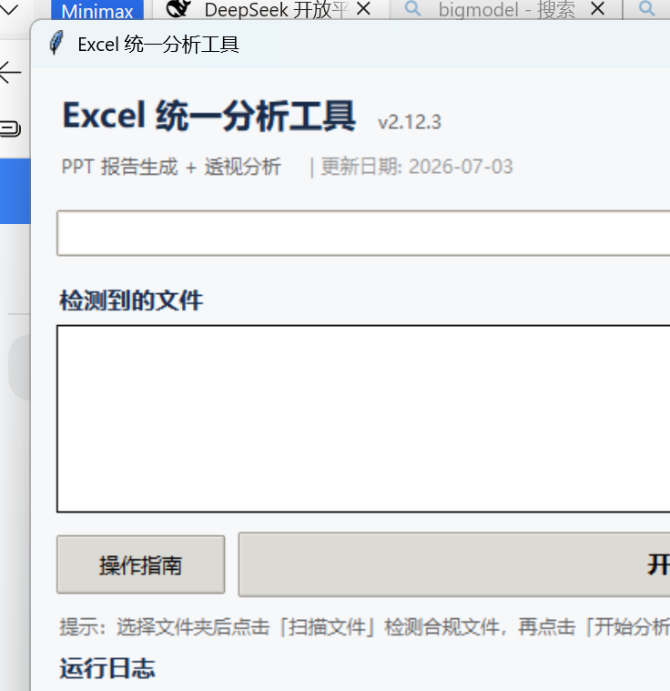

# Excel 统一分析工具

> Excel 数据分析 + PPT 报告生成 + 透视分析 + HTML 报告 四合一

## 快速开始

```bash
cd app

# 🆕 Web 模式（推荐）：浏览器界面，支持拖拽上传 + 在线预览
python server.py                # 自动打开 http://localhost:8899
# 如需局域网访问，显式指定监听地址（默认仅本机访问）
python server.py --host 0.0.0.0

# GUI 模式：点击「在浏览器中打开」可切换到 Web 界面
python main.py                  # 启动 Tkinter GUI

# 统一配置（一个 Excel 含多个 Sheet）
python main.py 项目配置.xlsx    # 自动检测 → 依次执行 PPT + 透视 + HTML

# 子命令方式
python main.py ppt 项目配置.xlsx      # 只生成 PPT
python main.py pivot 项目配置.xlsx    # 只跑透视分析
python main.py html 项目配置.xlsx     # 从配置生成 HTML 报告

# 传文件夹（自动查找配置文件）
python main.py ppt /path/to/folder
```

**多配置文件选择**：文件夹下有多个 `.xlsx` 时，文件名含「配置」/「config」的优先列为候选；有多个候选时进入交互选择：

```
[信息] 检测到 2 个配置文件，请选择:
  1. 测试配置.xlsx
  2. 项目配置.xlsx
请输入序号 (1-2)，回车默认选 1:
```

非交互环境（管道/重定向）自动选第一个并警告。也可用 `-c 文件名` 直接指定跳过选择。

### 配置格式（统一 Excel）

一个配置 Excel 包含两个 Sheet：

| Sheet 名 | 用途 | 自动匹配关键词 |
|---------|------|--------------|
| **PPT配置** | 页面+图表定义 | 包含「页码」「页面类型」等列头 |
| **透视分析** | 交叉透视+分组聚合任务 | 包含「数据源」「行维度」等列头 |

> 兼容旧格式：只有第一个 Sheet 有 PPT 列头时，自动兼容。

## 安装

```bash
pip install -r requirements.txt
```

### 依赖

| 包 | 用途 |
|---|------|
| openpyxl | Excel 读写 |
| pandas | 数据处理 |
| python-pptx | PPT 原生图表生成 |
| matplotlib | 地图/图表渲染 |
| cartopy | 地理地图底图 |

## 效果展示



> ⬆️ GUI 界面：选择文件夹 → 扫描文件 → 一键生成 PPT + 透视分析 + HTML 报告

## 功能概览

### 1. PPT 报告生成 (`ppt`)

从配置 Excel + 数据 Excel 一键生成 PPT，图表为 **原生可编辑 PPT 图表**（非静态图片）。

**支持的图表类型：**

| 类型 | 配置值 | 说明 |
|------|--------|------|
| 柱状图 | `column` | 默认类型 |
| 折线图 | `line` | 带圆形标记点 |
| 饼图 | `pie` | 百分比标签 |
| 散点图 | `scatter` | XY 坐标 |
| 面积图 | `area` | 填充区域 |
| 圆环图 | `doughnut` | 环形占比 |
| 组合图 | `column,line` | 柱状+折线双Y轴 |
| 散点地图 | `map` | 经纬度散点+指标着色 |
| 热力地图 | `heatmap` | 密度热力分布 |

**配置列（14列）：**

```
页码 | 页面类型 | 页面标题 | 布局 | 图表类型 | 数据Sheet | X轴 | Y轴 | 图表标题 | 区块名 | 结论模板 | 数据源 | 是否生成 | 文字内容
```

> **页面标题**：支持 `主标题|副标题` 语法，副标题合并到页面标题列（无需单独列）
> **颜色**：已移除，默认按图表序号从调色板循环取色，让每页图表颜色自动错开（兼容旧配置中的"颜色"列）
> **是否生成**：控制该页是否生成 PPT/HTML。填 `否`/`0`/`跳过`/`skip` 则跳过，默认「是」（兼容旧「HTML生成」列名）

**页面类型：**

| 类型 | 配置值 | 说明 |
|------|--------|------|
| 封面 | `封面` / `cover` | 左侧深色块 + 右侧标题 |
| 目录 | `目录` / `toc` | 自动收集内容页标题生成目录 |
| 章节分隔 | `章节` / `section` | 深色背景 + 居中大标题 |
| 内容 | `内容` / `content` | 图表/文字内容页（默认） |
| 结尾 | `结尾` / `ending` | 深色背景 + 致谢文字 |

**布局类型：** `1图` / `2图上下` / `2图左右` / `4图` / `左图右文` / `上文下图`

**PPT 主题换肤：** 配置 Sheet 表头行之前可添加"键|值"行自定义主题：

| 键 | 作用 | 示例 |
|---|---|---|
| 主色 | 标题装饰、默认柱色 | #1F4E79 |
| 深色 | 标题文字 | #1F3864 |
| accent1 | 额外强调色 | #2E75B6 |
| 页脚 | 页脚左侧文本 | 季度经营分析 |
| 字体 | 正文字体 | 思源黑体 |
| 调色板 | 多系列图表配色（逗号分隔） | #1F4E79,#2E75B6,#9DC3E6 |

### 2. 透视分析 (`pivot`)

配置驱动的交叉透视与分组聚合分析，支持多表 JOIN。

**聚合方式：** sum、avg、count、max、min、pct（占比）、count_pct（计数占比）、nunique（去重计数）

**配置列（15列）：**

```
序号 | 数据源 | Sheet | 行维度 | 列维度 | 值字段 | 聚合方式 | 结果Sheet | 行映射 | 值映射 | 分箱 | 值计算 | 是否计算 | 过滤条件 | 区块名
```

> **列映射**：已移除（兼容旧配置中的"列映射"列，找不到走默认值）

**值计算特性：**
- 单列运算：`*100`（乘）、`/1000`（除）、`+10`（加）、`-5`（减）
- 多列组合：`销售额/销量=单价`、`利润/销售额*100`

**百分比数据契约（pct / count_pct 聚合）：**
- 透视结果中百分比列始终以 **0~1 小数** 存储（如 0.376），Excel 用 `0.0%` 格式自动显示为 37.6%
- PPT 读取同一数据：饼图直接用 0~1 小数；柱/线图 ×100 画图并加 `%` 数据标签
- 识别方式：优先用聚合方式元信息（精确），列名含 `占比`/`pct`/`百分比`/`比例` 仅作兜底
- 注意：`率` 不再作为百分比关键词（避免误伤功率/速率/频率等非百分比字段）

**JOIN 语法示例：** `订单表 JOIN 客户表 ON 客户ID=客户ID`

### 3. HTML 报告生成 (`html`)

从 PPT 配置和透视结果自动生成可交互的 HTML 数据报告。

**特性：**
- 零配置：无需额外配置，直接从 PPT 配置+透视结果推断
- 图表切换：每个图表支持柱状图/折线图/饼图切换
- 响应式：适配手机、平板、电脑
- 离线浏览：ECharts 内嵌，无需联网
- PPT 配置中 `是否生成=否` 可跳过指定页面（PPT 和 HTML 同时生效）

### 4. PPT 模板填充 (`template`)

基于已有的 PPT 模板和透视结果进行数据替换，保留模板的版式、配色、图表样式，只替换数据。

**适用场景：** 需要精美定制版式，用户在 PowerPoint 中自由设计模板，工具只负责把透视数据灌进去。

**区块查找形式（三种，图表/表格/图片占位符同样适用）：**

| 形式 | 含义 | 适用场景 |
|------|------|---------|
| `区块名` | 跨所有 sheet 查找（兼容旧用法） | 区块名全局唯一 |
| `Sheet名.区块名` | 精确指定 sheet 内的区块 | 不同 sheet 内有同名区块 |
| `Sheet名` | 该 sheet 第一个区块（兼容旧用法） | sheet 内只有一个区块 |

**占位符语法：**

| 语法 | 含义 | 示例 |
|------|------|------|
| `{{区块名.列名}}` | 取该列合计值（数值列）或首行值 | `{{简单分组求和.总销售额}}` |
| `{{区块名.列名.行值}}` | 精确取某行某列的值 | `{{按地区汇总.总销售额.华东}}` |
| `{{Sheet名.区块名.列名}}` | 精确指定 sheet 内区块的列 | `{{按地区汇总.简单分组求和.总销售额}}` |
| `{{Sheet名.区块名.列名.行值}}` | 精确指定 sheet 内区块某行 | `{{按地区汇总.简单分组求和.总销售额.华东}}` |
| `{{区块名.行数}}` | 取该区块的数据行数 | `{{销售额分箱.行数}}` |
| `{{标量.标量名}}` | 取无行维度标量 | `{{标量.总销售额}}` |
| `{{区块名.列名.sum}}` | 聚合后缀（sum/avg/max/min/count） | `{{按地区汇总.总销售额.avg}}` |
| `{{图表:区块名}}` | 图表占位符（形状名称/替代文字） | `{{图表:按地区汇总}}` |
| `{{图表:Sheet名.区块名}}` | 图表占位符精确指定 sheet | `{{图表:按地区汇总.简单分组求和}}` |
| `{{表格:Sheet名.区块名}}` | 表格占位符精确指定 sheet | `{{表格:按地区汇总.简单分组求和}}` |

**PPT 备注配置（可选）：** 每页备注区可写 `区块=区块名` 声明本页默认区块，本页占位符可省略前缀。

**用法：**

```bash
# 基础用法
python main.py template 模板.pptx --pivot 透视结果.xlsx

# 指定输出
python main.py template 模板.pptx --pivot 透视结果.xlsx -o 输出.pptx

# 模板同目录有 _分析_ 文件时可自动识别
python main.py template 模板.pptx
```

## 案例

`cases/02_网络指标/` 包含：
- `项目配置.xlsx` — 统一配置（PPT配置 + 透视分析 两个 Sheet）
- `网络指标数据.xlsx` — 数据文件（小区指标 + 地理数据）

```bash
python main.py cases/02_网络指标/项目配置.xlsx
# 自动检测为综合配置，依次输出 .pptx 和 .xlsx
```

## 项目结构

```
excel2ppt/
├── app/
│   ├── main.py              # 统一入口 (CLI + GUI)
│   ├── server.py            # 🆕 Web 服务入口
│   ├── static/
│   │   ├── guide.html       # 操作指南
│   │   ├── gui_screenshot.png
│   │   └── web/
│   │       └── index.html   # 🆕 Web 前端界面
│   └── src/
│       ├── excel_reader.py   # 配置+数据+地理数据读取
│       ├── ppt_theme.py      # PPT 美化主题（配色/布局/字体/页面元素）
│       ├── ppt_builder.py    # PPT 原生图表构建引擎
│       ├── map_builder.py    # 地图可视化（cartopy + matplotlib）
│       ├── pivot_analyzer.py # 透视分析核心引擎
│       ├── excel_writer.py   # 透视结果写入 Excel
│       └── html_builder.py   # HTML 报告生成（ECharts 可视化）
└── cases/
    ├── 00_防护用例/          # 防护用例（自动化测试）
    ├── 02_网络指标/          # 网络指标示例
    └── 03_模板示例/          # 模板示例
```

## 版本变更

### v2.49.0 (2026-07-17)

**📖 规范化级联透视写法（唯一推荐写法，避免多选项混乱）**

为避免级联透视写法混乱，明确**唯一规范写法**，不再支持多选。

**核心原则**：
1. 前序任务必须填「区块名」列（作为后续引用的唯一标识）
2. 后续任务数据源写 `{区块名}`（唯一形式，不用 `{pivot}`/`{结果Sheet名}` 等）
3. 后续任务的行维度/值字段必须填**前序任务实际输出的列名**（值映射名或带聚合后缀名），不填原字段名

**前序任务输出列名规则**（决定后续引用写法）：
- 无值映射 → 列名带聚合后缀：`{原字段}_{聚合后缀}`，如 `5G用户数_求和`
- 有值映射 → 列名是值映射名：如 `值映射=总销售额` → 列名 `总销售额`
- 交叉透视（有列维度）→ 列维度值展开为列名：如 `地区`→`华东/华北/华南`

**完整规范示例**：

| 序号 | 数据源 | 行维度 | 列维度 | 值字段 | 聚合方式 | 值映射 | 区块名 |
|------|--------|--------|--------|--------|---------|--------|--------|
| 1 | 原始数据.xlsx | 站点,频段 | (空) | 5G用户数 | sum | | **站点级** |
| 2 | `{站点级}` | 频段 | (空) | 5G用户数_求和 | sum | | 频段汇总 |
| 3 | `{站点级}` | 城市 | (空) | 5G用户数_求和 | sum | | 城市汇总 |

**前序任务有值映射的规范写法**：

| 序号 | 数据源 | 行维度 | 列维度 | 值字段 | 聚合方式 | 值映射 | 区块名 |
|------|--------|--------|--------|--------|---------|--------|--------|
| 1 | 原始数据.xlsx | 地区 | (空) | 销售额 | sum | **总销售额** | **地区聚合** |
| 2 | `{地区聚合}` | 地区 | (空) | 总销售额 | sum | | 地区二次聚合 |

**禁止写法**：
- ✗ `{pivot}` / `{透视结果}` / `{prev}` / `{上一个}`（顺序依赖性强，易错）
- ✗ `{结果Sheet名}`（与区块名混淆，统一用区块名）
- ✗ 后续任务行维度/值字段填原字段名（应填前序输出列名）
- ✗ 前序任务不填区块名（后续无法引用）

### v2.48.0 (2026-07-17)

**🔧 增强级联透视"列不存在"报错的智能建议（值映射重命名场景）**

| 改动 | 说明 |
|------|------|
| **模糊包含匹配建议** | 当缺失列名是某可用列的子串时（如写"销售额"，实际列"总销售额"），给出建议"前序任务可能用值映射重命名了列" |
| **区块引用场景兜底提示** | 区块引用且无任何匹配建议时，提示"前序任务可能通过值映射重命名了列，请检查前序任务的值映射配置，用映射后的列名引用" |

**问题现象**：前序任务有值映射（如 `值字段=销售额, 值映射=总销售额`），输出列名变为 `总销售额`。后续任务用 `{区块名}` 引用时，若值字段/行维度仍写原字段名 `销售额`，报"列不存在: ['销售额']"且无建议。

**修复原理**：前序任务的值映射会把列名从原字段名（`销售额`）重命名为值映射名（`总销售额`）。增强报错逻辑：
1. 先尝试 `_聚合后缀` 前缀匹配（如 `5G用户数` → `5G用户数_求和`）
2. 再尝试模糊包含匹配（如 `销售额` → `总销售额`），并标注"前序任务可能用值映射重命名了列"
3. 都无匹配时，区块引用场景兜底提示检查前序任务值映射配置

**级联透视引用前序值映射结果的正确写法**：
```
# 前序任务配置
行维度: 地区
值字段: 销售额
值映射: 总销售额        ← 列名从"销售额"重命名为"总销售额"

# 后续任务引用（必须用值映射后的列名"总销售额"）
数据源: {区块名}
行维度: 地区
值字段: 总销售额        ← ✓ 用映射后的列名
# 值字段: 销售额        ← ✗ 报错，原字段名已不存在
```

**验证结果**：值映射列名引用成功；原字段名报错并给出模糊匹配建议；防护用例 32 任务零回归。

### v2.47.0 (2026-07-17)

**🔧 修复级联透视引用前序结果时行维度列名不匹配问题**

| 改动 | 说明 |
|------|------|
| **智能列名自动映射** | 级联引用前序分组聚合结果时，用户行维度/值字段若写原字段名（如"5G用户数"），自动映射到实际列名（如"5G用户数_求和"）。仅当唯一匹配时自动映射，多候选时不映射但给建议 |
| **仅区块引用启用** | 自动映射仅在数据源为 `{...}` 区块引用时启用，避免对原始文件误映射 |
| **多候选给出建议** | 当缺失列有多个候选（如"销售额_求和"和"销售额_均值"）时，报错信息给出候选列表供用户选择 |

**问题现象**：级联透视时，前序任务无列维度（分组聚合），输出列名带聚合后缀（如"5G用户数_求和"），后续任务用 `{区块名}` 引用时，行维度/值字段若写原字段名（"5G用户数"）会报"行维度列不存在"。

**修复原理**：前序分组聚合产生的列名格式为 `{原字段}_{聚合后缀}`（如 `5G用户数_求和`）。后续任务引用时，若用户写的列名在某可用列名的前缀位置（去掉 `_聚合后缀`），且唯一匹配，自动映射到实际列名。

**级联透视数据源写法（推荐）**：
```
# 方式1：写原字段名（v2.47.0+ 自动映射，最简单）
数据源: {区块名}
行维度: 5G用户数          ← 自动映射到 "5G用户数_求和"
值字段: 5G用户数          ← 同上

# 方式2：写带后缀的完整列名（精确匹配，兼容旧版）
数据源: {区块名}
行维度: 5G用户数_求和     ← 精确匹配
值字段: 5G用户数_求和

# 方式3：多聚合后缀场景必须写完整列名（自动映射无法区分）
# 前序: 值字段=5G用户数, 聚合方式=sum,mean → 列名 "5G用户数_求和" + "5G用户数_均值"
数据源: {区块名}
值字段: 5G用户数_求和     ← 必须写完整，否则报错并建议候选
```

**验证结果**：单聚合自动映射通过；多候选场景给出建议；防护用例 32 任务 + 级联透视用例 6 任务零回归。

### v2.46.0 (2026-07-17)

**🔧 修复级联透视引用前序结果时列丢失问题**

| 改动 | 说明 |
|------|------|
| **多结果横向合并存入 block_results** | 前序任务若返回多个 DataFrame（多值字段交叉透视场景），修复前 `break` 只存第一个，后续任务引用其他值字段列会报"列不存在"。现改为横向合并所有 DataFrame 后存入，去重复列 |
| **跳过 `_JOIN中间表_` 内部 key** | 合并时排除 JOIN 中间表等辅助 key，避免污染引用数据 |
| **增强"列不存在"报错信息** | 列数 >15 时截断显示（前10+后5）+ 总数；缺失列含 `_` 时提示"可能是引用了交叉透视结果，列维度值已展开为列名" |

**问题现象**：级联透视时，前序任务是多值字段交叉透视（如 `值字段=销售额,销量`），后续任务用 `{区块名}` 引用时报 `列不存在: ['xxx']。可用列: [...]`，可用列只显示部分列。

**修复原理**：`_cross_pivot` 对每个值字段×聚合产生独立 DataFrame，`main.py` 存入 `block_results` 时原逻辑 `break` 只取第一个。修复后用 `pd.concat(axis=1)` 横向合并，保证后续引用能看到所有列。

**级联透视数据源写法提醒**：
- 前序任务若是**交叉透视**（有列维度），列维度值会被展开为列名（如"地区"→"华东/华北/华南"），后续引用时直接用展开后的列名，不能用原列维度名
- 前序任务若是**分组聚合**（无列维度），列名保留原样（如"销售额_求和"），后续引用时用聚合后列名

**验证结果**：防护用例 32 任务零回归；级联透视用例 6 任务零回归；多值交叉透视引用测试通过。

### v2.45.0 (2026-07-17)

**🔧 修复 JOIN 数据源拼接 4 个 P0 级问题 + 2 个 P1 级问题**

| 改动 | 说明 |
|------|------|
| **P0-1：`@Sheet` 语法在 JOIN 中生效** | `_resolve_table_source` 新增 `sheet_hint` 参数，优先使用 `_split_table_token` 解析出的 `@Sheet`，而非模糊匹配。修复前 `表A@销售明细 JOIN 表A@产品目录` 会两次都读销售明细（自连接），结果错误但无报错 |
| **P0-2：JOIN 静默跳过改为报错** | 右表加载失败、ON 列名不存在时改抛 `ValueError`，由 `run_analysis` 捕获转为错误信息。修复前会静默丢失 JOIN 数据，用户得到部分 JOIN 的错误结果 |
| **P0-3：多键 JOIN 统一走列表分支** | 移除 `if len(left_keys)>1 and len(right_keys)>1` 的二分支判断，统一用列表形式处理单键/多键。新增左右键数量不一致的防御性校验 |
| **P0-4：validate 对 `{区块}+JOIN` 不误报** | 校验阶段识别 JOIN 中左右表的 `{...}` 区块引用，跳过文件存在性检查；对非区块引用的表逐个校验文件和 `@Sheet` 存在性 |
| **P1-7：ON 条件非等值时报错** | 检测 `!=`/`>`/`<`/`>=`/`<=` 非等值条件并抛 `ValueError`，提示用户在「过滤条件」列配置。修复前 `ON a.x=b.x AND a.y>b.y` 会静默丢弃 `>` 条件 |
| **P1-8：JOIN 检测对换行友好** | `_parse_join_spec` 入口检测从字面 `" JOIN "` 改为正则 `\bJOIN\b`，支持 Excel Alt+Enter 换行写法 |

**JOIN 写法示例**：
```
# 基础单键 JOIN
表A.xlsx JOIN 表B.xlsx ON 产品=产品

# 多键 JOIN（AND 分隔）
表A.xlsx JOIN 表B.xlsx ON 产品=产品 AND 地区=地区

# @Sheet 语法指定 sheet（同一文件多 sheet 场景）
测试数据.xlsx@销售明细 JOIN 测试数据.xlsx@产品目录 ON 产品=产品

# 区块引用作为左表（前序透视结果参与 JOIN）
{站点级} JOIN 场景映射表.xlsx ON 场景=场景

# 多表级联 JOIN
表A.xlsx JOIN 表B.xlsx ON k1=k1 JOIN 表C.xlsx ON k2=k2

# JOIN 类型（默认 INNER）
表A.xlsx LEFT JOIN 表B.xlsx ON 产品=产品
表A.xlsx RIGHT JOIN 表B.xlsx ON 产品=产品
表A.xlsx OUTER JOIN 表B.xlsx ON 产品=产品
```

**验证结果**：9 个专项测试全部 PASS（@Sheet 生效、右表缺失报错、列名不存在报错、单键 JOIN 正常、区块+JOIN 不误报、非等值报错、换行识别、区块引用+JOIN、多键 JOIN）；防护用例 32 个任务零回归。

### v2.44.0 (2026-07-16)

**✨ 透视结果支持混合布局：同一 sheet 内横向段 + 纵向段共存**

| 改动 | 说明 |
|------|------|
| **混合布局标记** | 结果Sheet名以 `\|混合` / `\|mixed` 结尾时启用混合模式，后缀自动剥离 |
| **区块级方向控制** | 混合模式下，区块名以 `\|横` / `\|横向` / `\|horizontal` 结尾的区块归入横向段，其余归入纵向段 |
| **`_write_mixed_layout_sheet`** | 新增混合布局写入函数：横向段（上方）从左到右并列 + 纵向段（下方）向下追加，段间空 1 行 |
| **`_parse_block_direction`** | 新增区块名方向后缀解析函数，返回 `(is_horizontal, clean_name)` |
| **写入函数返回结束行** | `_write_df_block_at` / `_write_scalar_block_at` 改为返回区块结束行号，便于混合布局串联调用 |
| **模式优先级** | 同 sheet 多任务时，模式优先级 `mixed > horizontal > vertical`，任一任务标记更高模式则整 sheet 升级 |
| **向后兼容** | 纯横向/纯纵向模式零回归；混合模式无横向区块时等价于纯纵向，无纵向区块时等价于纯横向 |

**使用示例**：
- 任务A结果Sheet=`对比分析|混合`、区块名=`地区分布|横` → 横向段
- 任务B结果Sheet=`对比分析|混合`、区块名=`产品分布|横` → 横向段
- 任务C结果Sheet=`对比分析|混合`、区块名=`时间趋势` → 纵向段
- 输出：地区分布 + 产品分布 在上方左右并列，时间趋势 在下方空 1 行后向下追加

### v2.43.0 (2026-07-16)

**✨ 透视结果支持横向布局：区块名不同时也可列追加**

| 改动 | 说明 |
|------|------|
| **横向布局标记** | 结果Sheet名以 `\|横向` / `\|横` / `\|horizontal` 结尾时启用横向列追加模式，后缀自动剥离 |
| **`_write_horizontal_layout_sheet`** | 新增横向布局写入函数：同 sheet 内多个区块从左到右并列，区块间空 1 列分隔 |
| **每区块独立标题** | 每个区块顶部一行合并标题行（跨该区块所有列），下面是表头+数据，各区块行数独立 |
| **支持场景** | 区块名不同、行维度不同也可横向并列，避免行数过多 |
| **辅助函数** | 新增 `_write_block_title_at` / `_write_df_block_at` / `_write_scalar_block_at` / `_style_header_row_at`，支持指定起始列写入 |
| **向后兼容** | 现有 32 个任务零回归，无 `\|横向` 后缀的 sheet 仍走行追加模式 |

**使用示例**：任务A结果Sheet=`分析结果\|横向`、区块名=`地区统计`，任务B结果Sheet=`分析结果\|横向`、区块名=`产品统计` → 两区块在"分析结果"sheet 内左右并列

### v2.42.0 (2026-07-16)

**✨ 透视分析支持引用前序透视结果作为数据源（二次透视）**

| 改动 | 说明 |
|------|------|
| **新增区块引用语法** | 透视配置的"数据源"字段支持三种引用语法，将前序任务的输出 DataFrame 作为当前任务的输入数据源，实现二次透视 |
| `{pivot}` / `{透视结果}` / `{prev}` / `{上一个}` | 引用上一个成功任务的输出 |
| `{区块名}` | 引用指定区块名的结果（区块名来自前序任务的"区块名"字段） |
| `{结果Sheet名}` | 引用指定结果Sheet名的结果（区块名与结果Sheet不同时两者都能命中） |
| `{pivot:区块名}` | 显式指代透视结果中的某区块 |
| **`_resolve_block_reference`** | 新增区块引用解析函数，放在 `_load_joined_dataframe` 开头优先处理，命中则直接返回 DataFrame 副本 |
| **`block_results` 别名** | `_run_pivot_mode` 中同时用区块名和结果Sheet名作为 key 存入 block_results，使两种引用方式都能命中 |
| **校验修复** | `validate_pivot_config` 扩展识别 `{区块名}` / `{pivot:区块名}` 等新语法，跳过文件存在性检查（存在性在执行时由 block_results 决定） |
| **向后兼容** | 现有 32 个任务零回归，新增能力不影响原有 Excel/CSV/JOIN 数据源加载 |

**使用示例**：任务A按地区汇总销售额 → 任务B数据源填 `{pivot}` 或 `{简单分组求和}`，对任务A的结果按地区做二次透视

### v2.41.0 (2026-07-16)

**⚡ HTML 性能优化：默认展示表格，点击图表按钮再渲染图表**

| 改动 | 说明 |
|------|------|
| **默认表格模式** | 所有 section 默认激活"表格"按钮并展示表格，图表 canvas 通过 `style="display:none"` 默认隐藏，打开时不初始化任何 ECharts 实例 |
| **按需渲染图表** | 用户点击图表按钮（柱状/折线/地图等）时才调用 `renderChart` 初始化对应图表，避免大量数据点地图等重型图表在打开时卡顿 |
| **表格显隐切换** | `renderChart` 增加表格容器显隐逻辑：切换到图表时隐藏表格，切换回表格时显示表格 |
| **清理死代码** | 移除不再使用的 `getDefaultChart` 函数和 IntersectionObserver 懒加载逻辑（默认表格模式下无需懒加载） |

### v2.40.0 (2026-07-16)

**⚡ HTML 打开性能优化：图表懒加载**

| 改动 | 说明 |
|------|------|
| **图表懒加载** | `initCharts()` 从一次性渲染所有图表改为 IntersectionObserver 懒加载：仅当 section 进入视口（提前 200px）时才初始化对应图表，避免打开时同时初始化 28 个 ECharts 实例导致卡顿 |
| **回退兼容** | 不支持 IntersectionObserver 的浏览器回退到一次性渲染 |
| **lazyUpdate** | `chart.setOption(options, {lazyUpdate: true})` 让 ECharts 延迟到下一帧渲染，减少主线程阻塞 |

### v2.39.0 (2026-07-16)

**🔧 地图散点样式优化：小点+指标染色+hover显示名称**

| 改动 | 说明 |
|------|------|
| **固定小点** | 散点大小固定为 8（symbolSize=8），不再随指标值归一化变化，视觉更清爽 |
| **指标染色-数值型** | 指标列全部为数字时，使用 visualMap 连续渐变染色（蓝→橙→红），左下角显示色阶图例 |
| **指标染色-离散型** | 指标列含非数字时，每个类别分配独立颜色（HUAWEI_PALETTE 8色循环），使用 visualMap piecewise 离散图例 |
| **hover显示名称** | 城市名默认隐藏（label.show=false），鼠标悬停时显示带半透明白底的名称标签 |
| **数据流增强** | 采集原始字符串值 metricRawVals 用于判断指标列数值/离散类型，不再强制 parseFloat 转换 |

### v2.38.0 (2026-07-16)

**🔧 修复国外经纬度地图显示问题**

| 改动 | 说明 |
|------|------|
| **自动选择地图** | 根据经纬度范围自动判断：所有点经度 73-135 且纬度 18-53 → 用 `china` 地图；否则 → 用 `world` 世界地图，解决国外经纬度无法显示的问题 |
| **Python 端** | `_generate_geo_chart_options` 新增 `all_in_china` 判断，geo.map 动态设为 `china` 或 `world` |
| **JS 端动态构建** | `buildGeoOptionFromData` 新增 `allInChina` 判断，geo.map 动态设置 |
| **地图加载器通用化** | `_loadChinaMap` 重构为 `_loadMapByName(mapName, cb)`，支持按需加载 china.js 或 world.js，GeoJSON 回退也区分 china/world |
| **渲染流程调整** | 地图类型先构建 option 读取 map 名，再加载对应地图数据后渲染 |

### v2.37.1 (2026-07-16)

**🔧 修复柱状图多系列重叠 + 多级分类轴顺序调整**

| 改动 | 说明 |
|------|------|
| **柱状图多系列重叠** | 移除 bar 系列的固定 `barWidth: '50%'`，让 ECharts 自动计算多系列并排布局，避免多数值列时柱子重叠 |
| **多级分类轴顺序** | 交换双 xAxis 顺序：第一级（靠近图表）= 子分类对齐数据点，第二级（下方）= 父分组带长刻度线居中分组，符合多级分类轴常规布局 |

### v2.37.0 (2026-07-16)

**🔧 多级分类 x 轴改用 ECharts 原生双 xAxis 方案**

| 改动 | 说明 |
|------|------|
| **原生双 xAxis** | JS 端 `catAxis()` 多列分类时返回双 xAxis 数组：第一级父分组（组首显示名称，长刻度线 `length:28` 形成分组带，视觉上居中分组）；第二级子分类（每个都显示，`alignWithLabel` 对齐标签），更接近 PPT 的多分类 x 轴效果 |
| **修复 NameError** | 移除注释中 `{start: 0}` 等被 Python `.format()` 误解析为格式化字段的内容，消除 `NameError: name 'start' is not defined` |
| **清理死代码** | 删除 `bandTicks` 未使用变量及 `parentByIndex`/`_parentByIndex` 中间字段；JS 端直接从 `d.categoryGroups` 构建父分组轴数据 |
| **fallback 同步** | Python 端 `_build_x_axis_option` 简化为返回第一级父分组轴配置，与 JS 端逻辑保持一致 |

### v2.36.0 (2026-07-16)

**🔧 分类列识别改为基于透视配置的行维度**

| 改动 | 说明 |
|------|------|
| **行维度传递** | `_run_pivot_mode` 返回 `(output_path, valid_tasks)`，`_run_html_from_pivot` 新增 `tasks` 参数，从中提取 `{结果Sheet: [行维度列名]}` 构造 dim_map 传入 HTML 生成器 |
| **精确分类列** | `generate_html_report` / `read_excel_data` / `_parse_blocks` 新增 `dim_map`/`dim_cols` 参数，section 中注入 `dim_indices`（行维度在表头中的索引） |
| **_detect_chart_columns 增强** | 新增 `dim_indices` 参数，优先级1：有 dim_indices 时直接作为分类列、其余为数值列；优先级2：无 dim_indices 时回退到表头关键词+数据采样 |
| **全链路适配** | main.py（CLI）、server.py（Web）所有调用点已更新，GUI 模式通过 `_run_pivot_mode` 返回值自动适配 |

### v2.35.3 (2026-07-16)

**🐛 修复数值列误判为分类列**

| 改动 | 说明 |
|------|------|
| **数值列检测增强** | `_detect_chart_columns` 新增数据采样判断：表头关键词未命中时，采样前15行检测某列是否>=70%为数字，是则判为数值列。修复「总销量」「平均销售额」等不含关键词的列被误判为分类列导致图表 x 轴错位的问题 |
| **关键词扩充** | 新增「销量/用户数/流量/RSRP/RSRQ/接通率/掉线率/丢包率/时延/带宽/利用率」等网络KPI相关数值列关键词 |

### v2.35.2 (2026-07-16)

**🐛 修复多级分类轴 + 图表数值标签 + 表头居中**

| 改动 | 说明 |
|------|------|
| **多级分类 x 轴** | 多列分类时改为双 xAxis 实现层级分类轴（参考 PPT 多分类 x 轴），主轴显示子分类、副轴显示父分类，不再拼接为单字符串 |
| **图表数值标签** | 柱状图/折线图/面积图数据点上方显示数值标签（百分比/千分位自动格式化） |
| **表头居中** | 表格表头改为居中对齐 |
| **折线图面积填充** | Python 端 fallback option 也移除了折线图的 areaStyle |

### v2.35.1 (2026-07-16)

**🐛 修复 + 样例数据增强**

| 改动 | 说明 |
|------|------|
| **折线图修复** | 折线图误加了 `areaStyle` 导致和面积图视觉一样，已移除面积填充 |
| **表格居中** | 表格所有数据列改为居中对齐（原数字列右对齐） |
| **维度列颜色区分** | 行维度列加蓝色背景+加粗样式，表头同步高亮，一眼区分维度列与数值列 |
| **网络KPI样例数据** | 测试数据新增「网络KPI」sheet（24行，含RSRP/RSRQ/接通率/掉线率/时延/带宽利用率等指标） |
| **基站数据扩充** | 基站分布从12条扩充到25条，覆盖杭州/南京/武汉/长沙/重庆/西安/沈阳等13个新城市 |
| **透视任务扩充** | 项目配置新增6条网络KPI透视任务（地区运营商KPI/基站性能/月度趋势/交叉表/流量占比/基站分布） |

### v2.35.0 (2026-07-16)

**✨ HTML 报告全面优化升级——现代化视觉 + 暗色模式 + 全功能增强**

#### 🎨 视觉重构
| 改动 | 说明 |
|------|------|
| **CSS 变量驱动** | 全部颜色/间距/圆角/阴影改为 CSS 变量，为暗色模式奠基 |
| **现代化卡片** | section 加左侧色带（多色循环）、12px 圆角、柔和阴影、28px 留白 |
| **毛玻璃 Header** | 渐变背景 + `backdrop-filter: blur` 毛玻璃效果 |
| **胶囊按钮** | nav-bar 按钮改为胶囊形，加 emoji 图标 |
| **字体层级** | h1=22px/700、h2=20px/600、正文=14px、行高 1.7 |
| **表格数字右对齐** | 自动检测数字单元格，右对齐 + tabular-nums |
| **暗色模式** | 🌙/☀️ 一键切换，localStorage 持久化，跟随系统偏好，ECharts 主题适配 |

#### 📊 图表升级
| 改动 | 说明 |
|------|------|
| **柱状图渐变** | LinearGradient 顶部不透明→底部半透明，圆角 6px |
| **折线图面积** | 面积渐变填充，空心圆数据点，3px 粗线 |
| **饼图环形** | 改为环形图，中心显示总计文字 |
| **新增图表类型** | 面积图 / 雷达图 / 散点图 |
| **图表工具栏** | 全屏查看 / 导出 PNG / 堆叠切换 |
| **动画** | animationDuration 1000ms + cubicOut 缓动 |

#### 🔧 功能增强
| 改动 | 说明 |
|------|------|
| **数值格式化** | 百分比自动转换、千分位分隔、智能单位（万/亿） |
| **多列 x 轴** | 多维透视时 x 轴合并多列（如 `华东-产品A`） |
| **标量指标卡片** | 1 行数据不画图，改为指标卡片网格突出展示 |
| **表格排序** | 表头点击三态切换（升/降/原序），▲▼ 箭头 |
| **表格搜索** | 实时关键字过滤 |
| **导出 CSV** | 一键导出当前表格数据 |
| **列选择全选** | 一键全选/全不选数值列 |
| **目录全展开/收起** | sidebar 顶部一键操作所有一级目录 |
| **滚动高亮目录** | IntersectionObserver 自动高亮当前 section 对应目录项 |
| **折叠持久化** | 目录展开状态存 localStorage |
| **悬浮返回顶部** | 右下角固定按钮，滚动 >300px 显示 |
| **全局搜索** | nav-bar 搜索框高亮匹配 section |
| **summary 卡片** | emoji 图标 + 趋势标签 + 多色配色 + 智能单位 |
| **内容区加宽** | max-width 960→1280px，图表高度 350→400px |

#### 🐛 Bug 修复
- `_build_chart_data_js` 中 `parts` 变量名冲突导致 JS 裸文本输出（`ReferenceError: 华南 is not defined`）
- 删除死代码 `_ppt_chart_type_to_html` / `_find_data_in_excel`
- `buildGeoOptionFromData` 中 `eval` 替换为安全闭包

### v2.34.0 (2026-07-15)

**🐛 修复：布局居中 + 坐标精度**

| 修复 | 说明 |
|------|------|
| **布局优化** | 目录侧边栏改为 `position:fixed` 固定在屏幕左侧，内容区域通过 `content-wrapper` 居中，不再出现横向滚动 |
| **坐标精度修复** | 透视引擎对非百分比数值列默认 `round(2)` 会把经纬度截断到 2 位小数。新增 `_col_round_precision` 函数，识别经度/纬度/lat/lon 列名自动使用 6 位精度 |

### v2.33.0 (2026-07-15)

**✨ HTML 图表支持列选择——可勾选部分列绘图，解决维度不一致问题**

多列数据（如销售额万元 vs 销量个 vs 客户数人）维度不一致不应同图显示。现在每个图表上方增加列选择面板：

| 能力 | 说明 |
|------|------|
| **列选择复选框** | 图表按钮下方显示所有数值列的复选框，默认全选，可取消勾选 |
| **动态重渲染** | 勾选/取消后即时重建 ECharts option 并重新渲染图表 |
| **只显示多列场景** | 单列数据（如只有销售额）不显示选择器，避免干扰 |
| **自动隐藏** | 切换到表格/地图视图时列选择器自动隐藏 |

实现：新增 `_build_chart_data_js` 序列化图表原始数据到 JS `chartData`，新增 `buildChartOption` JS 函数根据勾选状态动态构建 option（替代预生成死数据），新增 `_build_col_selector_html` 生成复选框面板。

### v2.32.3 (2026-07-15)

**♻️ 地图控件统一：指标列和筛选列共用全部列选项**

移除硬编码的"数值列=指标 / 文本列=筛选"互斥逻辑，两个下拉框现在展示完全相同的列选项。任何列都可作为散点大小依据，也都可作为筛选维度。

### v2.32.2 (2026-07-15)

**🐛 修复 HTML 报告基站地图显示销售数据的问题**

| 修复 | 说明 |
|------|------|
| **数据源不匹配** | PPT 配置页21/22 的"数据Sheet"从`基站分布`(原始数据)改为`基站分布数据`(透视结果)，数据源改为`透视结果` |
| **经纬度列缺失** | 透视任务26 值字段加入`经度,纬度`(max聚合)，保证透视结果含经纬度列供地图识别 |
| **地图类型未识别** | PPT 配置模式下 section 生成时检测经纬度列，含经纬度时 available_charts 追加 map/heatmap |

### v2.32.1 (2026-07-15)

**✨ HTML 报告表格滚动 + 目录序号优化**

| 优化 | 说明 |
|------|------|
| **表格滚动显示** | 数据表格限制最大高度 360px，超出部分垂直滚动，表头固定不滚动 |
| **行数提示** | 表格标题栏显示"共 N 行"，滚动时更清晰 |
| **目录序号徽章** | 侧边栏每个目录项前加蓝色序号方块，区块导航更直观 |

### v2.32.0 (2026-07-15)

**✨ 防护用例精简为单个全特性综合用例**

将原有多个分散的测试用例合并为一个覆盖全部功能的综合用例，同时修复模板模式散点图验证缺陷。

| 变更 | 说明 |
|------|------|
| **单一综合用例** | 26 个透视任务覆盖全部聚合方式（sum/avg/count/pct/count_pct/max/min/nunique/去重拼接）+ JOIN + 值计算 + 值映射 + block合并 + 标量引用 + 分箱 + 过滤 |
| **PPT 全特性覆盖** | 24 页配置（23 页实际生成）覆盖封面/目录/章节/内容/结尾 + 6 种布局 + 10 种图表类型（column/bar/pie/line/area/scatter/doughnut/combo/map/heatmap）+ 结论模板 + 长标签旋转 + 跳过页 |
| **经纬度地图数据** | 新增「基站分布」数据 sheet（12 站点含经纬度/用户数/流量），供 PPT map/heatmap 图表 + HTML 地图展示 |
| **模板验证修复** | 修复 `verify_template_mode` 中 `XL_CHART_TYPE` 未导入导致散点图验证静默失败的缺陷 |

### v2.31.1 (2026-07-15)

**✨ HTML 地图支持指标列切换 + 数据筛选**

经纬度数据表中通常还包含其他列（指标列、分类列），本次更新支持：

| 能力 | 说明 |
|------|------|
| **指标列切换** | 下拉选择哪一列作为散点大小依据（如用户数/流量GB），实时重渲染 |
| **筛选列选择** | 下拉选择按哪一列筛选（如地区/运营商），自动填充该列唯一值 |
| **筛选值多选** | 复选框勾选要显示的值，支持全选/取消全选，实时过滤数据点 |
| **动态构建** | 客户端 JS 根据控件状态动态构建 ECharts option，无需重新请求 |

**新增**：
- `_build_geo_data_js()` — 序列化地图 section 完整数据到 JS `geoData` 对象
- `_build_geo_controls_html()` — 构建控件面板 HTML（指标列下拉 + 筛选列下拉 + 筛选值复选框）
- `buildGeoOptionFromData()` — JS 端动态构建地图 option（含指标列选择 + 筛选逻辑）
- `onGeoMetricChange / onGeoFilterColChange / onGeoFilterValChange / onGeoFilterAllChange` — 控件交互处理

### v2.31.0 (2026-07-15)

**✨ HTML 报告支持地图展示（经纬度数据自动渲染散点地图）**

透视结果 Excel 中含经纬度列（经度/纬度、lat/lon、longitude/latitude）的 sheet，HTML 报告自动识别并用 ECharts 地图组件渲染：

| 能力 | 说明 |
|------|------|
| **自动识别** | sheet 表头含经纬度关键词时，自动切换为地图类型，图表按钮为「地图/热力图/表格」 |
| **散点地图** | 经纬度定位数据点，散点大小按指标值归一化，鼠标悬停显示名称+经纬度+指标 |
| **热力地图** | effectScatter 涟漪效果，橙色发光，突出热点区域 |
| **交互** | 地图可拖拽缩放（roam），tooltip 显示完整信息 |
| **地图数据** | 按需加载 china 地图（CDN：echarts 4.x china.js，回退：DataV GeoJSON） |

**新增函数**：
- `_detect_geo_columns()` — 检测表头中的经纬度列索引
- `_generate_geo_chart_options()` — 生成 ECharts geo + scatter 选项（含 JS tooltip formatter）
- `_loadChinaMap()` — JS 端按需加载 china 地图数据并注册

### v2.30.2 (2026-07-15)

**🐛 修复 HTML 报告图表全部不显示**

HTML 报告中所有 ECharts 图表均无法渲染，根因是两个独立 bug 叠加：

| Bug | 位置 | 原因 | 修复 |
|-----|------|------|------|
| chartOptions 累积丢失 | `html_builder.py` L446 | `chart_options_js` 在 for 循环内每次重置为空，只有最后一个 section 的配置被写入 HTML | 新增 `all_chart_options_js` 累积变量，循环内追加 |
| sectionId 解析错误 | HTML 模板 JS | `key.split('_')` 把 `section_0_bar` 拆成 `["section","0","bar"]`，sectionId 误取为 `section`，找不到容器 | 改用 `lastIndexOf('_')` 从末尾分割，正确提取 `section_0` |

修复后 18 个 section 共注册 52 条 chartOptions（柱/折/饼），图表正常渲染。

### v2.30.0 (2026-07-15)

**✨ 透视分析自动附带 HTML 交互报告**

凡是生成透视 Excel 的场景，均自动同步生成 HTML 报告，无需新增命令或额外配置。

| 入口 | 配置类型 | 输出 |
|------|---------|------|
| CLI/GUI/Web | 综合（PPT + 透视） | PPT + 透视 Excel + HTML |
| CLI/GUI/Web | 仅透视 | 透视 Excel + HTML |
| CLI/GUI/Web | 仅 PPT | PPT（不涉及透视） |

覆盖全部入口：`python main.py pivot`、`python main.py 配置.xlsx`（auto）、Web 上传分析，均一视同仁。HTML 报告复用 `generate_html_report` 的纯 Excel 自动生成模式：每个 sheet 自动生成一个图表 section，图表类型（柱状/折线/饼图/表格）按列名关键字自动推断，输出文件命名为 `{配置名}_报告.html`。

### v2.29.0 (2026-07-15)

**🔧 透视分析字段名校验 + 移除 `@` 标量语法**

**1. 字段名禁用字符校验**：配置校验阶段拦截会破坏解析的特殊字符，报错提示用户。

| 校验位置 | 禁用字符 | 原因 |
|---------|---------|------|
| 值字段 / 行维度 / 列维度 | `, = @ { } \n \r` | 破坏多元素分隔 / 值计算表达式 / 占位符 |
| 值映射 | `= @ \n \r` | 破坏表达式（`{}` 是合法占位符语法，不禁用） |
| 值计算结果列名 | `, @ \n \r` | 新生成列名不能含分隔符 |

校验失败时输出示例：`字段名 '完成率=目标' 含禁用字符 ['=']（会破坏配置解析或值计算）`

**2. 移除 `@` 标量引用语法**：值计算中 `@标量名` 改为直接用裸标量名。

| 旧语法（已废弃） | 新语法 |
|----------------|--------|
| `@总销售额/@总销量` | `总销售额/总销量` |
| `*@总销售额` | `*总销售额` |

标量自动识别：表达式中的标识符若不在列名中但在 `scalar_context` 中，自动作为标量处理（多列分支已支持，单列分支的 `*标量名`/`/标量名` 也已支持）。

### v2.28.0 (2026-07-15)

**✨ 透视分析聚合方式支持自定义数字显示格式**

在「聚合方式」列用 `|` 附加数字格式，控制结果单元格的显示格式（原始数值不变，只改显示）。

**语法与 PPT 模板占位符完全一致**（复用 `_KNOWN_FMTS` 白名单，Python format spec 风格）：

| 写法 | 含义 | Excel 显示 | 示例 |
|------|------|-----------|------|
| `sum\|.2f` | 2位小数 | `0.00` | `4800.00` |
| `sum\|.0f` | 整数 | `0` | `4800` |
| `avg\|.1%` | 1位百分比（×100） | `0.0%` | `37.6%` |
| `pct\|.2%` | 2位百分比（覆盖默认 0.0%） | `0.00%` | `37.65%` |
| `sum\|,.0f` | 千分位整数 | `#,##0` | `4,800` |
| `sum\|,.2f` | 千分位2位小数 | `#,##0.00` | `4,800.00` |
| `sum\|int` | 整数（同 .0f） | `0` | `4800` |
| `sum\|.2e` | 科学计数法 | `0.00E+00` | `4.80E+03` |
| `去重拼接\|、` | join 分隔符（与格式正交，不冲突） | — | `产品A、产品B` |

**多聚合示例**：`sum|,.0f,sum|.2f`（逗号分隔多聚合，格式内的逗号如 `,.0f` 自动保护不被切断）

**优先级**：自定义格式 > pct 默认（`0.0%`）> 普通默认（`0.00`）

> 原始数值完整写入 Excel（如 `0.3765`），`number_format` 控制显示（如 `.2%` → `0.00%` 显示为 `37.65%`），不影响后续 PPT/HTML 读取。

### v2.27.0 (2026-07-15)

**✨ 透视分析值映射支持引用前面任务的计算数值**

值映射文本现在支持 `{区块.列.行值|格式}` 占位符，可在列名中嵌入前面任务计算出的数值，让列名显示为带数字的描述性文本。

**语法**（与模板填充的文本占位符一致）：

| 写法 | 含义 | 示例 |
|------|------|------|
| `{区块.列名}` | 该列所有行的合计值 | `{按地区汇总.总销售额}` → `12750` |
| `{区块.列名.行值}` | 精确取某行某列的值 | `{按地区汇总.总销售额.华东}` → `4800` |
| `{区块.列名\|格式}` | 合计值 + 格式化 | `{按地区汇总.总销售额\|.2f}` → `12750.00` |
| `{区块.列名.行值\|格式}` | 精确取值 + 格式化 | `{按地区汇总.总销售额.华东\|.0f}` → `4800` |

**格式后缀**：

| 后缀 | 含义 | 示例 |
|------|------|------|
| `.Nf` | 保留 N 位小数 | `.2f` → `4800.00` |
| `.N%` | 百分比（×100 显示） | `.2%` → `37.65%` |
| `int` | 整数 | `int` → `4800` |
| 无 | 原始值 | → `4800` |

**示例**：值映射填写 `华东占{按地区汇总.总销售额.华东|.0f}元`，结果列名显示为 `华东占4800元`。

> 引用规则：区块名为前面任务的「区块名」配置值；引用前面任务前需确保该任务的值字段列已通过值映射命名为被引用的列名（如"总销售额"）。

### v2.26.0 (2026-07-15)

**✨ 透视分析新增「去重拼接」聚合方式**

将分组内的值去重后拼接成字符串，类似 SQL 的 `GROUP_CONCAT`。适用于按地区汇总产品名、按部门汇总负责人等场景。

**聚合方式写法**（在透视配置 Excel 的「聚合方式」列填写）：

| 写法 | 分隔符 | 示例输出 |
|------|--------|---------|
| `去重拼接` | 默认 `+` | `产品A+产品B+产品C` |
| `去重拼接\|、` | 顿号 | `产品A、产品B、产品C` |
| `去重拼接\|,` | 逗号 | `产品A,产品B,产品C` |
| `拼接` | 默认 `+` | 同上 |
| `join` | 默认 `+` | 同上 |
| `group_concat` | 默认 `+` | 同上 |

**特性：**
- 默认分隔符为加号 `+`，可通过 `|` 自定义
- 排序后输出，保证同组数据无论行顺序如何拼接结果一致
- 自动跳过空值和重复值
- 支持与数值聚合组合使用（如 `sum,去重拼接` 对不同列分别聚合）
- 支持无行维度、有行维度、交叉透视三种场景
- 非数值列友好，不触发数据类型校验错误

### v2.25.0 (2026-07-14)

**✨ template 模式新增缺失标注（默认开启）**

未替换的占位符在生成 PPT 中醒目标注，便于快速定位数据缺失：

- **文本占位符**：未匹配时替换为红字加粗 `[缺失:原表达式]`（如 `[缺失:区块.列名]`）
- **表格占位符**：数据区块未找到时，首格填入 `[缺失:区块名]` + **黄底高亮** + 红字加粗
- **图表占位符**：数据区块未找到时，形状名称追加 `[缺失:区块名]` 标记 + 警告日志
- **计算占位符**：表达式无法求值时同样标注 `[缺失:计算:...]`

**开关控制：**
- 默认开启标注（调试友好）
- 加 `--no-mark` 关闭（正式交付场景，恢复原"清空/保留原样"行为）

**用法示例：**
```bash
# 默认开启缺失标注
python main.py template 模板.pptx --image-dir 数据 -o 输出.pptx

# 关闭标注（正式交付）
python main.py template 模板.pptx --image-dir 数据 -o 输出.pptx --no-mark
```

### v2.24.1 (2026-07-14)

**✨ 新增 --ts 时间戳开关**

- 所有模式（auto/ppt/pivot/template）新增 `--ts` 可选参数
- 启用后输出文件名追加 `_YYYYMMDD_HHMMSS` 时间戳
- 默认不加时间戳（保持简洁文件名）
- auto 模式综合配置时，两个输出文件共用同一时间戳

**用法示例：**
```bash
# 默认（无时间戳）
python main.py pivot -c 配置.xlsx --data-dir 数据 -o 结果.xlsx
→ 输出: 结果.xlsx

# 加时间戳
python main.py pivot -c 配置.xlsx --data-dir 数据 -o 结果.xlsx --ts
→ 输出: 结果_20260714_181410.xlsx

# auto 模式加时间戳
python main.py -c 配置.xlsx --data-dir 数据 -o 输出目录/ --ts
→ 输出: 输出目录/配置_报告_20260714_181410.pptx
       输出目录/配置_分析_20260714_181410.xlsx
```

### v2.24.0 (2026-07-14)

**🔧 强制必填参数，消除自动检测歧义**

- pivot/ppt/auto 模式：`-c/--config`、`--data-dir`、`-o/--output` 三者均为必填，未提供时报错退出
- template 模式：模板文件、`--image-dir`、`-o/--output` 三者均为必填
- 位置参数不再接受文件夹（避免自动扫描选错配置文件），只接受配置文件路径
- auto 模式 `-o` 改为指定输出目录（综合配置时在该目录下生成 `*_报告.pptx` 和 `*_分析.xlsx`）
- 移除 `_auto_find_data_file` 的隐式回退逻辑（data_dir 必填后不再需要）

**参数校验示例：**
```
# 正确
python main.py pivot -c 配置.xlsx --data-dir 数据目录 -o 结果.xlsx

# 错误（缺少 --data-dir）
python main.py pivot -c 配置.xlsx -o 结果.xlsx
→ [错误] pivot 模式必须指定 --data-dir <数据目录>

# 错误（传文件夹而非配置文件）
python main.py pivot cases/00_防护用例
→ [错误] 请直接指定配置文件路径，而非文件夹
```

### v2.23.2 (2026-07-14)

**🐛 修复数据列名首尾空格导致字段匹配失败**

- `read_data_file` 读取 Excel/CSV 后未对列名做 strip，导致数据文件列名带空格时与配置字段名不匹配
- 现在统一在 `read_data_file` 返回前对 DataFrame 列名做 `strip()`，与配置侧的 strip 行为对齐
- 影响范围：透视分析的行维度/列维度/值字段匹配，PPT 图表的 X/Y 轴列名匹配

### v2.23.1 (2026-07-14)

**🗑️ 移除 HTML 报告功能**

- 删除 `html` 子命令和 `_run_html_mode` 函数
- auto 模式不再自动生成 HTML 报告
- 移除 `--ppt-file` 参数（html 专用）
- `app/src/html_builder.py` 文件保留但不再被调用

### v2.23.0 (2026-07-14)

**🔧 命令行架构统一整合**

- 消除原先 4 套 parser（help subparsers / legacy / template专用 / GUI专用），统一为 `_make_config_parser()` + template 专用 parser
- 统一参数名：`--pivot-file` 全局共用（`--pivot` 作为别名保留兼容旧用法）
- `--pivot-dir` 改名为 `--image-dir`（语义更准确，避免与 `--data-dir` 混淆），`--pivot-dir` 作为别名保留
- ppt/pivot/html/auto 共享 `--data-dir`、`--pivot-file`、`--ppt-file`、`--check` 等公共参数
- ppt 模式新增 `--data-dir` 支持（原先只有 pivot/auto 支持）
- help 输出改为自定义格式，清晰区分子命令和选项
- 向后兼容：所有旧参数名（`--pivot`、`--pivot-dir`）均保留别名

### v2.22.3 (2026-07-12)

**✨ 透视分析支持 --data-dir 独立数据目录参数**

- pivot/auto 模式新增 `--data-dir` 参数，指定数据文件所在目录
- 配置表格中"数据源"的相对路径基于 `--data-dir` 解析，而非配置文件所在目录
- 未提供 `--data-dir` 时保持原行为（基于配置文件所在目录）
- 输出目录仍基于配置文件所在目录，不受 `--data-dir` 影响
- 用法：`python app/main.py pivot 配置目录 --data-dir 数据目录`

### v2.22.2 (2026-07-12)

**🐛 修复 |t 转置标志系列裁剪错误**

- 修复 `_write_chart_data` 中 transpose 分支 `_trim_extra_series` 用错系列数的问题
- 转置后实际写入的系列数是行数（行维度值作系列名），但裁剪时用的是列数-1（非转置方向的系列数）
- 当行数 > 列数-1 时，转置后的多余系列被错误裁掉，导致图表只显示部分系列
- 现在转置分支使用 `len(df)` 作为期望系列数，确保所有行维度值系列都保留

### v2.21.0 (2026-07-12)

**✨ PPT 模板模式散点图支持多区块/多 Sheet 数据合并**

- 备注区用 `;` 分隔多个区块表达式，每个区块独立解析后形成一个散点图系列
- 支持 `Sheet名.区块名` 跨 Sheet 引用，不同 Sheet 的不同区块可合并到同一散点图
- 系列名自动加区块名前缀（如 `实验A.压力`、`实验B.压力`），避免重名
- 语法示例：`散点图1=SheetA.区块A ; SheetB.区块B|xy|X,Y ; 区块C`
- 单区块场景完全兼容原语法（无 `;` 时走原逻辑）
- 非散点图遇多区块声明时取第一个区块，自动降级

### v2.20.2 (2026-07-12)

**🔧 修复模板模式百分比数据显示为小数的问题**

- `load_pivot_results` 读取数据行单元格的数字格式，识别百分比列（格式串含 `%`）
- 百分比列信息存入 `df.attrs["pct_columns"]`，通过 `_filter_df_columns` 切片时保留
- `_write_chart_data` 优先使用元信息识别百分比列，不再依赖列名关键词猜测
- 修复混合场景逻辑：多数系列为百分比时（超过一半）也使用 `0.0%` 格式
- 解决 `完成率`、`增长率` 等不含"占比"关键词的百分比列显示为小数的问题

### v2.20.1 (2026-07-12)

**✨ PPT 模板模式散点图支持方案 C：独立 xy 对模式**

- 新增 `|xy` 标志：`{{图表:区块名|xy}}` 表示列按 (X1,Y1,X2,Y2,...) 顺序配对，每对形成一个独立系列
- 每个系列拥有独立的 X 值，支持"多组独立实验数据叠加"场景
- 列数为奇数时自动回退到共享 X 模式并打印警告
- 兼容组合语法：`{{图表:区块名|xy|列1,列2}}`（xy 对模式 + 指定列）

### v2.20.0 (2026-07-12)

**✨ PPT 模板模式支持散点图数据替换**

- `_write_chart_data` 按图表类型分支：散点图用 `XyChartData`，其余维持 `CategoryChartData`
- 散点图第一列作 X 数值，其余列各成一个 Y 系列（支持多系列共享 X）
- 修复散点图 X 轴被强制字符串化导致坐标系错乱的问题
- 散点图数据标签默认显示数值格式 `#,##0.##`

### v2.19.3 (2026-07-10)

**🔧 `--pivot` 指定数据文件时，自动以其所在目录作为图片搜索目录**

- 指定了 `--pivot D:\数据\结果.xlsx` 后，图片相对路径自动优先在 `D:\数据` 下查找
- 无需再单独传 `--pivot-dir`，数据和图片同目录场景一行命令搞定
- 优先级：`--pivot-dir` > `--pivot` 文件所在目录 > 模板所在目录

### v2.19.2 (2026-07-10)

**➕ `--pivot-dir` 同时作为图片搜索目录**

- 复用 `--pivot-dir` 参数：指定后不仅搜索数据文件，图片相对路径也优先在该目录查找
- 图片路径查找优先级：绝对路径 > `@output/` > `--pivot-dir` 指定目录 > 模板所在目录
- 适用场景：数据和图片放在同一目录，模板在另一目录时只需一个参数

### v2.19.1 (2026-07-10)

**➕ 图片替换支持备注区声明 + 图表百分比数据标签修复**

- 图片替换新增备注区声明方式：`形状名=图片路径`（与图表/表格的 shape_block_map 机制统一）
- 修复模板填充模式下图表数据标签百分比显示为小数的问题：写入图表数据后检测百分比列（列名含占比/pct/百分比/比例关键词且值域 0~1），自动设置数据标签格式为 `0.0%`

### v2.19.0 (2026-07-10)

**🎨 模板填充保留各 run 原始格式（颜色、字号、加粗等）**

- 重写 `_replace_in_text_frame` 的替换逻辑：不再将整段文本塞入第一个 run，而是逐 run 定位占位符并仅替换对应文本
- 占位符所在的 run 保留其格式（如红色 24pt 加粗），周围文本的格式不受影响
- 支持占位符跨越多个 run 的场景（替换值放入首个 run，清除后续 run 的占位符残留）
- 逆序处理匹配项，避免位置偏移问题

### v2.18.21 (2026-07-10)

**➕ 模板模式支持 `--pivot-dir` 指定自动发现搜索目录**

- 新增 `--pivot-dir` 参数，可指定搜索最新 xlsx 的目录（递归扫描子目录）
- 未指定时默认搜索模板所在目录，与之前行为一致
- 适用于模板和数据源不在同一目录的场景

### v2.18.20 (2026-07-10)

**🔄 模板模式自动发现透视结果：递归扫描目录，按修改时间取最新**

- `--pivot` 未指定时，不再依赖 `_分析_` 命名模式，改为递归扫描模板所在目录及所有子目录下所有 `.xlsx` 文件
- 自动排除临时文件（`~$`）、配置文件（含"配置"/"config"）、模板文件（含"模板"/"template"）
- 按文件修改时间排序，取最新文件，输出时显示文件名、修改时间和绝对路径
- 支持 `--pivot latest` 显式触发自动发现
- 解决模板与数据在不同目录、文件名不包含"分析"、目录不以"output"开头等场景

### v2.18.19 (2026-07-09)

**🆕 图表/表格数据源支持在备注区声明（方案C：形状名映射）**

- 图表和表格的 `{{图表:xxx}}` / `{{表格:xxx}}` 占位符现在可以直接在备注区声明，不再强制写在形状名称中
- 用法：PPT 中形状名称写简短标识（如 `图表1`、`表格1`），备注区写 `图表1=区块名` 或 `表格1=区块表达式`
- 支持完整的区块表达式语法：`Spec名.区块名`、`|列1,列2` 选列等
- 优先级：形状名称/替代文字中的 `{{图表:xxx}}` > 备注区的形状名映射 > 图表标题回退
- 示例：
  - 备注：`图表1=按地区汇总` — 对应名称叫"图表1"的图表形状
  - 备注：`表格1=地区多维统计|总销售额,平均销售额` — 对应名称叫"表格1"的表格，含选列
- PPT 备注配置文档更新：支持 `形状名=区块表达式` 语法

### v2.18.18 (2026-07-09)

**🆕 图表标题支持文本占位符（标题内可嵌套数据值/计算结果）**

- 图表标题（chart title）现在支持所有文本占位符语法，与正文文本框共用替换逻辑
- 支持的占位符：`{{区块.列}}`、`{{区块.列.行值}}`、`{{计算:表达式|格式}}`、别名、格式后缀等
- 数据源占位符 `{{图表:xxx}}` 仍写在形状名称/替代文字中（不污染标题）
- 示例：
  - 标题写：`华东{{按地区汇总.总销售额.华东}}万元 占比{{计算:按地区汇总.总销售额.华东 / 按地区汇总.总销售额.sum|.2%}}`
  - 替换后：`华东4800万元 占比37.65%`
- 适用场景：标题需要显示动态数值（如某地区销售额、占比、环比等）

### v2.18.17 (2026-07-09)

**🆕 文本占位符支持格式后缀（按原占位符语法附加输出格式）**

- 文本占位符 `{{区块.列}}` 现在支持可选格式后缀 `{{区块.列|格式}}`，与计算占位符共用格式集合
- 取值时用原始值（不截断精度），再按指定格式输出，避免 `0.3765` 被先截成 `0.38` 再格式化
- 支持的格式：`.2f`（2位小数）、`.0f`（取整）、`.2%`（百分比自动×100加%）、`int`、科学计数法、千分位等
- 示例：
  - `{{按地区汇总.总销售额.华东|.2f}}` → `4800.00`
  - `{{地区占比.销售额占比.华东|.2%}}` → `37.65%`（原始值 0.3765 自动×100）
  - `{{区块.列|int}}` → 整数
- 重构：`_KNOWN_FMTS` 和 `_split_expr_and_fmt` 提取为模块级，计算占位符与文本占位符共用

### v2.18.16 (2026-07-09)

**🆕 PPT 备注区别名机制（文本占位符可写在备注区，正文用短占位符）**

- 新增备注区 `别名.别名名=表达式` 语法，正文用 `{{别名名}}` 引用，避免长表达式堆在正文
- 表达式支持文本占位符表达式（如 `按地区汇总.总销售额.华东`）和 `计算:` 表达式（如 `计算:利润/销售额|.2%`）
- 示例：
  - 备注：`别名.华东销售额=按地区汇总.总销售额.华东`
  - 备注：`别名.利润率=计算:利润/销售额|.2%`
  - 正文：`华东销售额: {{华东销售额}}，利润率: {{利润率}}`
- 适用场景：多个长表达式占位符堆在正文影响模板设计，把表达式集中放到备注区管理

### v2.18.15 (2026-07-09)

**🆕 PPT 文本占位符支持内联运算（计算两个数的相对提升关系）**

- 新增 `{{计算:表达式}}` 占位符，支持在 PPT 文本框内直接做算术运算，无需先在透视分析阶段算出结果列
- 表达式中的标识符沿用现有文本占位符语法（区块.列.行 / 区块.列.聚合 / Sheet.区块.列 / 标量.标量名 / 单段列名用 default_block）
- 支持的运算符：`+ - * /` 和括号 `()`，常量支持整数和小数
- 可选格式化后缀 `|格式`，支持 `.2f` / `.0f` / `int` / `.2%`（百分比自动 ×100 加 %）等
- 找不到值的标识符按 0 处理；除零等异常返回空字符串
- 示例：
  - `{{计算:(本月-上月)/上月*100}}` — 环比提升%
  - `{{计算:利润/销售额|.2%}}` — 利润率
  - `{{计算:销售额.max - 销售额.min|.0f}}` — 极差取整
  - `{{计算:A.总销售额.华东 / A.总销售额.sum|.2%}}` — 华东占比
- 防护用例新增页8（5 项验证：占比/差额/极差/默认区块运算），全部通过

### v2.18.14 (2026-07-08)

**🆕 图片占位符支持通配符模糊匹配**

- 解决文件名或子目录名带时间戳后缀（如 `chart_20260708_211405.png`）时写死路径找不到文件的问题
- 新增通配符 `*` 和 `?` 支持，用 glob 模糊匹配
- 示例：
  - `{{图片:@output/chart_*.png}}` → 匹配输出目录下唯一 `chart_xxxxx.png`
  - `{{图片:@output/report_*/a.png}}` → 匹配 `report_xxxxx` 子目录里的 `a.png`
- 多个匹配时取第一个（按名称排序），匹配前会提示
- 通配符与 `@output/` 前缀、绝对路径、相对模板目录三种形式均可组合
- 防护用例页3 新增通配符验证（三张图片全部替换），31 项全通过

### v2.18.13 (2026-07-08)

**🆕 图片占位符支持 @output/ 前缀（相对输出目录）**

- 解决输出目录带时间戳后缀（如 `output_20260708_211405`）时相对路径写死找不到文件的问题
- 新增 `{{图片:@output/相对路径}}` 语法，从输出目录查找图片
- `fill_template` 提取 `output_dir` 传入 `_replace_pictures` 和 `_resolve_image_path`
- 路径解析顺序：绝对路径 → `@output/`（相对输出目录）→ 相对模板目录 → 透视数据解析
- 防护用例全部通过（向后兼容，不影响现有路径）

### v2.18.12 (2026-07-08)

**🐞 修复值计算字段换行符导致多列组合计算失败**

- 问题：Excel 单元格用 Alt+Enter 输入换行时，值计算等逗号分隔字段会含 `\n`，导致多个表达式被合并为一个、eval 执行报语法错误
- 修复：读取配置时将 `\n` `\r` 统一替换为逗号，等价于逗号分隔
- 影响字段：行维度、列维度、值字段、聚合方式、值映射、分箱、值计算
- `_apply_value_calc` 内 split 前增加防御性换行符处理
- 防护用例任务9 值计算末尾加换行符验证修复，全部通过

### v2.18.11 (2026-07-08)

**🆕 图表/表格占位符支持选列**

- 区块列数太多时，可只选其中几列填充，不再需要改透视配置
- 新增 `|` 语法：`{{表格:区块名|列1,列2}}`、`{{图表:区块名|列1,列2}}`
- 第一列（行维度）自动保留，无需在选列中声明
- 列名逗号分隔，不存在的列自动跳过
- 不写 `|` 时保持原行为（全量列，向后兼容）
- 新增 `_parse_block_and_cols()`、`_filter_df_columns()` 两个辅助函数
- 防护用例新增页7验证选列，共 31 项验证全通过

### v2.18.10 (2026-07-08)

**🐞 修复表格替换后格式丢失问题**

- 原因：`cell.text = ...` 会清空段落重建 run，导致模板单元格的字体、颜色、对齐、填充全部丢失
- 新增 `_set_cell_text_preserve_format()` 函数：保留第一个段落第一个 run 的格式属性，只替换文本
- 表头和数据行填充均改用新函数，模板表格样式（背景色、字体色、对齐方式）完整保留
- 多段落单元格：保留段落格式，清空多余段落文本
- 空段落（无 run）回退到 `add_run` 继承段落默认格式

### v2.18.9 (2026-07-08)

**🆕 模板占位符示例补全 + 透视支持字符串列 max/min**

- 防护用例测试模板页3 图片占位符补全第二种方式：`{{图片:区块名.列名.行值}}` 从透视数据取图片路径
- 页3 现有两种图片占位符：绝对路径方式 + 透视数据取路径方式，验证两张图片均替换成功
- 测试数据"销售明细"新增"报告图片"列，透视配置新增任务22"地区图片"区块（max 聚合保留字符串路径值）
- 修复透视分析对字符串列 max/min 聚合的两个 bug：
  1. 配置校验 `NUMERIC_AGGS` 移除 max/min（pandas 字典序对字符串合法）
  2. 聚合执行不再对 max/min 强制 `pd.to_numeric`（避免字符串路径被转成 NaN 导致"值字段全为空"）
  3. 非数值列不再调用 `.round(2)`（避免字符串列报错）
- 防护用例验证项保持 27 项全部通过

### v2.18.8 (2026-07-08)

**🆕 模板填充支持 Sheet名.区块名 精确查找**

- 占位符支持 `Sheet名.区块名` 形式精确指定 sheet 内的区块，解决不同 sheet 中同名区块无法区分的问题
- 三类占位符均支持新语法：
  - 文本：`{{Sheet名.区块名.列名}}`、`{{Sheet名.区块名.列名.行值}}`
  - 图表：`{{图表:Sheet名.区块名}}`
  - 表格：`{{表格:Sheet名.区块名}}`
- `load_pivot_results` 新增 `sheet_block_map` 记录 `"Sheet名.区块名" → DataFrame`
- 新增 `_lookup_block()` 统一区块查找逻辑（图表/表格占位符改用此函数）
- `_resolve_text_placeholder` 改造为先尝试双段前缀 `Sheet名.区块名` 精确匹配，回退到旧的单段区块名跨 sheet 查找
- 完全向后兼容：旧用法（仅区块名）继续有效
- 防护用例新增页6 验证 `Sheet名.区块名` 精确查找，验证项从 21 项扩展到 27 项，全部通过

### v2.18.7 (2026-07-08)

**🧪 模板替换防护用例扩充至 21 项**

- 测试模板从 4 页扩展到 5 页，新增同 sheet 多区块引用验证
- 页5：同 sheet 内两个区块（`简单分组求和` + `标量消费者`）独立引用
- 验证项：
  - 区块1 文本取值正确（华东总销售额=4800）
  - 区块2 文本取值正确（华东销量占比=0.03）
  - 表格引用区块2成功（表头含销量占比）
  - 图表引用区块1成功（分类含华东）
- 全部 21 项验证通过

### v2.18.6 (2026-07-08)

**🐞 模板填充支持 sheet 内多区块按区块名索引**

- 透视结果一个 sheet 中可能有多个区块（以区块标题行分隔），之前只读取第一个区块
- 重构 `load_pivot_results`：扫描所有 sheet 的所有区块，按区块名独立索引
- 区块名优先级高于 sheet 名（sheet 名作为别名指向该 sheet 第一个区块，兼容旧用法）
- 防护用例数据区块从 17 个扩展到 31 个（之前丢失的 14 个区块现在可访问）
- 例如：`按地区汇总` sheet 内的 `简单分组求和`、`标量消费者` 现在都能独立引用

### v2.18.5 (2026-07-08)

**🔧 模板填充结果输出到结果文件夹**

- 模板填充结果 PPT 从 `cases/00_防护用例/` 改为输出到 `output_xxx/` 结果文件夹
- 与透视结果 Excel、PPT 报告、HTML 报告放在一起，便于统一查看
- 模板文件本身仍保留在防护用例目录

### v2.18.4 (2026-07-08)

**🐞 图表标题保留模板原样**

- 图表占位符改为**只从形状名称/替代文字读取**，不再污染图表标题
- 替换数据后图表标题保持模板原文字不动
- 兼容旧模板：若形状名称无占位符，仍回退读取图表标题
- 防护用例新增 2 项图表标题保留验证，共 15 项全通过

**📝 占位符标记方式更新**

| 对象 | 推荐标记位置 | 旧方式（兼容） |
|------|------------|--------------|
| 图表 | 形状名称或替代文字 | 图表标题（回退读取） |
| 表格 | 形状名称或替代文字 | - |
| 图片 | 形状名称或替代文字 | - |

### v2.18.3 (2026-07-08)

**🐞 图表/表格占位符替换后未清除**

- 图表标题中的 `{{图表:区块名}}` 在数据替换后仍残留，现替换为区块名
- 表格形状名称中的 `{{表格:区块名}}` 在数据替换后仍残留，现替换为区块名
- 图片形状是删除重建，不存在残留问题

### v2.18.2 (2026-07-08)

**🧪 模板替换防护用例扩充**

- 测试模板从 1 页扩展到 4 页，覆盖模板填充全部四类对象
- 页1：文本占位符 + 图表占位符（原有场景）
- 页2：表格整体替换 + 行列自动扩展验证（模板 2×2 → 数据 3×8，验证扩展）
- 页3：图片替换验证（绝对路径方式，自动生成测试图片）
- 页4：多区块图表 + 备注声明默认区块（验证省略前缀占位符 `{{总销售额}}`）
- 验证项从 4 项扩展到 13 项，全部通过
- 新增 `_generate_test_image()` 辅助函数（PIL 生成占位图片，无外部依赖）

### v2.18.1 (2026-07-08)

**🔄 表格替换支持自动扩展行列**

- 数据比模板表格多时自动扩展：新增行列复制相邻行列的样式（边框/字体/配色）
- 数据少于模板行数时自动清空多余行（旧数据不再残留）
- 不再需要预先在模板中预留足够行/列——1行1列的模板也能填入任意大小数据
- 新增 `_expand_table_columns()`、`_expand_table_rows()`、`_clear_table_row()` 三个辅助函数

### v2.18.0 (2026-07-08)

**🆕 模板模式支持表格整体替换**

- 模板表格形状的名称或替代文字中写入 `{{表格:区块名}}`，自动用透视数据整表替换内容
- 保留模板表格样式：边框、字体、配色、列宽等不变，只替换单元格文本
- 表头对应 DataFrame 列名，数据行逐行填充
- 超出模板行数的数据自动截断，超出列数的数据自动跳过
- 新增 `_replace_table_data()` 函数，输出统计新增 `table_replacements` 字段

### v2.17.0 (2026-07-08)

**🆕 模板模式支持图片替换**

- 模板驱动填充新增图片替换功能，支持两种匹配方式：
  1. **精确匹配**：在模板图片形状的替代文字(Alt Text)或名称(Name)中写入 `{{图片:路径}}`
     - PowerPoint 右键图片 → 查看替代文字 → 填入 `{{图片:chart.png}}`
     - 或通过选择窗格重命名形状为 `{{图片:C:\images\logo.png}}`
  2. **文本关联**：在文本框中写 `{{图片:路径}}`，自动替换同页第一张未被精确匹配的图片
- 路径解析优先级：绝对路径 → 相对模板目录 → 透视数据解析（`{{图片:区块名.列名.行值}}`）
- 图片按原占位尺寸替换，保留下游版式不变
- 新增 `_resolve_image_path()`、`_replace_pictures()`、`_do_replace_picture()` 三个函数
- 输出统计新增 `picture_replacements` 字段

### v2.16.5 (2026-07-07)

**🆕 CLI 运行日志自动落盘（远程排查利器）**

- CLI 模式（`python main.py ...` / `run.bat`）启动时自动安装 stdout/stderr Tee，所有输出同时写入 `logs/last_run.log`（固定文件名，每次运行覆盖）
- 文件头部记录版本号、运行参数、时间戳，方便定位环境
- UTF-8 编码，避免中文/特殊字符乱码
- **用途**：在其他机器/环境运行出错时，只需传回 `logs/last_run.log` 一个小文件即可定位问题，无需截图或复制控制台
- GUI 模式不干扰（仍走 `_GuiLogRedirector` 写入日志框）

### v2.16.4 (2026-07-07)

**🐞 防护用例测试脚本健壮性修复**

- 修复 `run_test.py` 模板替换模式测试因 `测试模板.pptx` / `模板填充结果.pptx` 被 PowerPoint 占用导致 `Permission denied` 而中断的问题
- 新增旧文件预清理逻辑：保存前先尝试删除旧模板/输出文件，删除失败（文件被占用）时自动回退到带时间戳的临时文件名
- 现在即使旧 PPT 文件被打开，测试也能正常完成

### v2.16.3 (2026-07-07)

**🐞 列名含括号时值计算失败**

- `用户数(万)`、`活跃用户(占比)` 等含括号列名被旧版正则token拆分破坏（`[^\s+\-*/()=]+` 排除了括号）
- 改用**从已知列名反向查找**策略：收集 calc_df 列名/值字段/值映射/标量名，按长度降序在表达式中搜索完整列名
- 新增 `_mask_token` 渐进式占位替换，防止短名子串误匹配长名

### v2.16.2 (2026-07-07)

**🔄 值计算多列分支重构 + 精度/显示优化**

- **彻底解决列名限制**：`pd.eval()` → Python逐行 `eval()`，中文列名、数字开头列名等任何格式的列名均可参与计算
- **列名映射增强**：表达式标识符按优先级查找：直接匹配 → 值映射名 → 值字段原始名反查 → 聚合后缀名 → 隐式标量
- **失败日志详细化**：不匹配时输出未识别标识符、可用列名、值映射、可用标量，精准定位问题
- **修复多列表达式入口缺失**：`_find_matching_calc` 兜底逻辑确保多列表式在无值字段名匹配时仍被触发

**🔢 PPT 数值显示优化**

- 底层数据不再截断，改用 Excel `number_format` / PPT `number_format` 仅控制显示精度
- 图表数据标签：整数显示整数（`#,##0.##`），小数保留小数位
- 结论卡片：`val == int(val)` 判断，整数不追 `.00`
- Excel 写入：非百分比列统一 `number_format='0.00'`，百分比列 `'0.0%'`

**🎯 静默启动 + 日志记录**

- 新增 `run.vbs`：双击静默启动 GUI，不显示 CMD 窗口
- `run.bat` 增强：日志自动写入 `logs/run_YYYYMMDD_HHMMSS.log`

### v2.16.1 (2026-07-07)

**🐞 列名以数字开头时多列组合 `eval` 失败**

- `4g终端用户数`、`5G终端数` 等以数字/大写开头的列名不是合法 Python 标识符，`pd.eval()` 无法解析
- 修复方案：`eval` 失败后自动给非法标识符列名加反引号 `` `5g终端用户数` `` 重试
- 覆盖两处 eval 调用：直接 eval + 列名替换后 eval

**🧪 防护用例扩充**

- 新增任务21：异名映射多列组合计算（值映射 `金额,数量` 与原始字段 `销售额,销量` 完全不同，无子串关系）
- 新增页22：PPT 配置中引用异名映射结果图表
- 更新 PPT 页数验证（22页配置→21页实际，页21跳过）

### v2.16.0 (2026-07-07)

**🆕 值计算 `@标量名` 显式标量引用语法**

- 新增 `@标量名` 语法，**强制使用历史标量值**而非当前列，解决列名/标量名冲突时的歧义
- `@总销售额/总销量=占比` → 使用标量 `总销售额`（而非当前行的 `总销售额` 列）
- `@总销售额/@总销量=全局单价` → 纯标量运算
- `/@总销售额`、`*@总销量` → 单列对标量的四则运算
- 同时支持多列分支和单列分支

**🐞 多列组合计算修复**

- 重构 [pivot_analyzer.py](file:///f:/【1】AI探索/【3】excel2ppt/app/src/pivot_analyzer.py) `_apply_value_calc` 多列分支逻辑：
  - 先尝试直接 `eval`（表达式使用映射后列名），失败后再构建替换映射
  - 新增聚合后缀列名查找（无值映射时自动匹配 `销售额_求和` 等列名）
  - 使用占位符替换避免子串替换问题（如 `销售额` 是 `总销售额` 的子串）
- 分支判断优化：以运算符开头（`*/+-`）走单列分支，否则走多列/标量 `eval` 分支

### v2.15.1 (2026-07-06)

**🆕 `all` 模式自动生成 HTML 报告**

- `main.py` 默认模式（`all`）现在自动追加 HTML 报告生成，无需单独执行 `python main.py html`

### v2.15.0 (2026-07-06)

**🆕 PPT 模板填充模式**

- 新增 `template` 子命令：基于已有 PPT 模板和透视结果进行数据替换
- 支持 6 种占位符语法：`{{区块.列}}`、`{{区块.列.行}}`、`{{区块.行数}}`、`{{标量.名}}`、聚合后缀、图表占位符
- 图表数据替换：保留模板图表样式/配色/类型，只替换数据源
- PPT 备注配置：每页备注区可声明默认区块，占位符省略前缀
- 适合需要精美定制版式的场景，与现有配置生成模式并存
- 新增 `app/src/template_filler.py`
- 防护用例新增 3 项模板替换验证（文本占位符/图表数据/文件大小）

### v2.14.0 (2026-07-06)

**🆕 值计算支持引用标量（单列简化写法）**

- 单列值计算现在支持直接引用历史标量名，无需写完整多列表达式
- 例如 `值计算=/总销售额` 等价于之前的 `值计算=销量/总销售额=销量占比`
- 新增 `_resolve_scalar_or_number` 辅助函数，先尝试 float 解析，失败则查 `scalar_context`
- 支持 `+ - * /` 四种运算符后跟标量名

### v2.13.3 (2026-07-06)

**🐞 GUI 修复 + 一键启动**

- 修复 GUI「在浏览器中打开」按钮点击无反应：`_open_web` 现在会延迟 1.5s 后在 GUI 线程打开浏览器，并在日志区显示反馈
- `server.py` 新增 `--no-browser` 参数，避免子进程重复尝试打开浏览器
- 新增 `run.bat` 一键启动脚本：自动检测 Python 环境、安装缺失依赖、启动 GUI，双击即可运行

### v2.13.2 (2026-07-06)

**🔧 配置校验支持区块名定位**
- `validate_ppt_config` 读取数据文件列名时，若图表配置了「区块名」，自动定位到区块名行下方取表头，而非始终读首行
- 修复场景：数据文件中包含多区块时（首行为区块标题、次行为表头），校验误报"X/Y轴列名在首行中未找到"

### v2.13.1 (2026-07-06)

**🔧 配置校验优化**
- `validate_ppt_config` 现在跳过「是否生成=否」的页面，不再对其校验布局名、图表类型、X/Y 轴列名等
- 跳过关键词与生成阶段保持一致：`否/no/false/0/不生成/跳过/skip`
- 修复场景：临时关闭某页生成时，配置未填写完整会阻断整个 PPT 生成流程

### v2.13.0 (2026-07-04)

**🆕 Web 模式（浏览器界面）**
- 新增 `server.py` Flask Web 服务，`python server.py` 启动
- Web 前端：拖拽上传 Excel → 一键执行 → 实时日志 SSE 推送 → 在线预览 + 下载
- Excel 预览：后台读取 openpyxl 转 HTML 表格，带样式
- PPT 预览：Pillow 逐页渲染为 PNG，左右翻页浏览
- 新增依赖：`flask>=3.0`, `Pillow>=10.0`

**🎨 GUI 美化**
- 标题栏改为深蓝渐变 Canvas 横幅（`#182B49`→`#2E75B6`）
- 各功能区添加白色卡片包裹（圆角边框 + emoji 图标标签）
- 新增「🌐 在浏览器中打开」按钮，一键启动 Web 模式
- 路径输入框改为浅灰底色原生 Entry

**📝 其他**
- requirements.txt 新增 Flask / Pillow

### v2.12.2 (2026-07-03)

**🛡️ 防护用例扩展（全图表类型+全布局覆盖）**
- 新增 4 个透视任务：散点图/环形图/面积图/组合图数据源
- 新增 9 页 PPT 覆盖全部图表类型和布局：

| 页 | 类型 | 验证点 |
|----|------|--------|
| 12 | 章节 | 章节分隔页（带装饰元素） |
| 13 | 2图上下 | area + column 双图表 |
| 14 | 4图 2×2 | 4 个 chart 网格 |
| 15 | 上文下图 | 文字 + 图表 |
| 16 | scatter | XY 散点图（城市销售额vs销量） |
| 17 | doughnut | 环形图（产品占比） |
| 18 | area | 面积图（季度趋势） |
| 19 | combo | 组合图（柱+折线双Y轴） |
| 20 | 结尾 | 第二结尾页 |

**🐛 修复**
- 散点图 X 轴使用实际数据值（之前误用序号 index）

**📊 覆盖统计**
- PPT 共 21 页配置 → 20 页实际（1 页跳过）
- 覆盖 7 种图表类型：column, bar, pie, line, scatter, doughnut, area, combo
- 覆盖 6 种布局：1图, 2图左右, 2图上下, 4图, 左图右文, 上文下图
- 0 错误 0 警告（PPT 校验全部通过）

### v2.12.1 (2026-07-03)

**✨ 新功能（多主题切换）**
- 新增 11 套预设配色主题（基于 PPT Generator Skill 配色方案）
- 配置方式：在 PPT 配置 Sheet 表头前加一行 `主题|珊瑚活力`，自动切换
- 支持的主题：默认, 午夜商务, 科技深空, 珊瑚活力, 暖陶简约, 海洋渐变, 炭灰极简, 青绿信任, 莓果奶油, 鼠尾草静, 樱桃大胆
- 新增 `get_theme_preset(name)` 和 `list_theme_names()` 工具函数
- `PptTheme.__init__` 新增 `theme_name` 参数，`from_config` 支持主题名

**🎨 视觉优化**
- 封面页：新增主题色装饰几何圆点 + 底部装饰条
- 章节页：新增左上角强调色装饰块 + 右下角微细圆点
- 结尾页：新增对称强调色装饰圆点
- 结论卡片：背景/边框色跟随主题（不再硬编码暖黄色）
- 页面标题：左侧装饰竖条加宽（0.08→0.10 inch）

**🐛 Bug 修复**
- 修复「值映射」被误用作列映射导致值字段名被覆盖的问题
- 修复 `collect_task_scalars` numpy 数值类型被 `isinstance(int)` 误判为 False

**📝 防护用例**
- PPT 配置新增 "主题|珊瑚活力" 键值行，验证封面左侧块 dark=#2F3C7E
- `_read_sheet_data` 修复：多区块 Sheet 只读取第一区块数据
- 新增主题色验证 + 标量消费者验证（销量占比=销量/总销售额）
- 全部验证通过

### v2.12.0 (2026-07-03)

**✨ 新功能（历史标量引用）**
- 值计算公式可引用之前无行维度任务的计算结果（标量值）
- 语法：在值计算列写 `当前列/历史标量名=结果列名`
- 示例：任务15生产"总销售额"（无行维度 sum）→ 任务16写 `销量/总销售额=销量占比`
- 实现：
  - `_run_pivot_mode` 维护 `scalar_context` 字典，每任务后收集单行结果
  - `_apply_value_calc` 接收 `scalar_context`，公式中未匹配到列名的变量自动查标量
  - 新增 `collect_task_scalars()` 工具函数

**📝 防护用例**
- 新增任务15（标量生产者）+ 任务16（标量消费者）
- 全部验证通过

### v2.11.0 (2026-07-03)

**✨ 新功能（区块名合并 & 行维度列配色）**
- 同一 Sheet 中相同「区块名」的 task 自动合并输出，即使中间隔了其他区块名
- 按区块名首次出现顺序输出
- 行维度列（分组透视列）使用独立配色区分于数值列：
  - 表头浅蓝（#5B9BD5）vs 普通列深蓝（#4472C4）
  - 数据区极浅蓝（#EBF5FB）背景
  - 合计行/总计行颜色优先

**📝 防护用例**
- 新增同区块名不连续合并验证 + 行维度列头颜色验证
- 全部验证通过：34 项 Excel + 9 项 PPT + 5 项主题色

### v2.10.6 (2026-07-03)

**🔧 优化（无行维度输出改进）**
- 无行维度时，值字段与聚合方式改为按位置 **1:1 对应**（与有行维度一致）
- 无行维度结果改为**横向展开**（一行多列），替代原来的纵向"指标|值"两列表
- 新增 `_get_agg_label` 辅助函数，统一聚合方式的中文标签生成

**📝 防护用例**
- 新增无行维度测试任务（值字段=销售额,客户数，聚合=sum,avg → 横向1行2列）
- 全部验证通过：32 项 Excel + 9 项 PPT + 5 项主题色

### v2.10.5 (2026-07-03)

**✨ 新功能（GUI 配置选择）**
- GUI 扫描到多个配置文件时显示下拉选择框，用户可选择后再运行
- 单配置文件时下拉框自动隐藏

### v2.10.4 (2026-07-03)

**✨ 新功能（命令行配置选择）**
- 文件夹下有多个配置文件时，列出候选让用户输入序号交互选择
- 非交互环境（管道/重定向）自动选第一个并警告
- 支持 `-c 文件名` 直接指定跳过选择

### v2.10.3 (2026-07-03)

**🐛 修复（百分比数据一致性）**
- 重构百分比处理逻辑，统一 Excel 与 PPT 对百分比数据的解读
- **pivot_analyzer**：pct/count_pct 结果携带 `_pct_columns` 元信息，明确标记哪些列是百分比列
- **excel_writer**：
  - 优先用 `_pct_columns` 元信息识别百分比列（精确），不再靠列名猜测
  - 百分比列值保持 0~1 小数，用 Excel 内置 `0.0%` 格式自动 ×100 显示
  - 移除"率"关键词（避免误伤功率/速率/频率等非百分比字段）
  - 移除 `_pct_already_scaled`（"列名含%就认为已缩放"的假设与 pct 输出矛盾）
- **ppt_builder**：识别百分比列后，柱/线图 ×100 画图 + 数据标签加 `%`，值轴刻度加 `%`
- **ppt_theme**：`style_chart` 新增 `is_pct` 参数，控制百分比图的数据标签和值轴格式

**🔧 优化**
- excel_writer 的 pandas 导入移至文件顶部（修复 `_merge_same_dim_results` 使用 `pd.concat` 的潜在问题）

**📝 防护用例**
- 新增 4 项百分比验证：占比值0~1小数、占比列number_format含%、占比存储值未×100、计数占比0~1小数
- 新增 PPT 验证：百分比饼图0~1小数（确认 PPT 拿到 0~1 而非 ×100 后的值）
- 全部验证通过：30 项 Excel + 9 项 PPT + 5 项主题色

### v2.10.2 (2026-07-03)

**🔧 优化（配置表简化）**
- PPT 配置移除「副标题」列：副标题用 `主标题|副标题` 语法合并到「页面标题」列（兼容旧"副标题"列）
- PPT 配置移除「颜色」列：默认按图表序号从调色板循环取色，让每页图表颜色自动错开（兼容旧"颜色"列）
- 透视分析配置移除「列映射」列（兼容旧"列映射"列，找不到走默认值）
- PPT 配置列从 16 列精简为 14 列；透视分析配置列从 16 列精简为 15 列

**📝 防护用例**
- 测试数据配置表头同步更新（PPT 14 列 / 透视 15 列）
- 全部验证通过：26 项 Excel + 8 项 PPT + 5 项主题色

### v2.10.1 (2026-07-03)

**🔧 优化**
- PPT 配置移除「HTML生成」和「HTML图表类型」两列，新增「是否生成」列统一控制 PPT 和 HTML 的页面生成
- 借鉴透视表「是否计算」的机制，填 `否`/`0`/`跳过`/`skip` 跳过该页（兼容旧「HTML生成」列名）
- HTML 报告不再支持图表类型覆盖，统一使用 PPT 图表类型

**📝 防护用例**
- 测试数据扩展至 12 页配置（页12 设为「是否生成=否」验证跳过）
- 新增「是否生成跳过」验证项（8 项 PPT 功能断言）

### v2.10.0 (2026-07-03)

**✨ 新增**
- PPT 美化主题模块化：新增 `ppt_theme.py`，封装配色/布局/字体/封面/标题/页脚/图表样式/结论卡片为 `PptTheme` 类
  - 支持数据换肤（`theme_config`）和结构换肤（子类化）两种模板扩展方式
  - `from_config` 从配置 Excel 的 colors/general 构建主题，实现配置驱动的换肤
- PPT 新增页面类型：目录页（`toc`）、章节分隔页（`section`）、结尾页（`ending`）
- PPT 配置新增「文字内容」列：左图右文/上文下图布局时渲染文字区
- PPT 主题换肤：配置 Sheet 表头行之前可添加"键|值"行自定义主题色/页脚/字体
- X 轴标签自动旋转：类别数 >6 或标签长度 >4 时自动旋转 -45°
- 结论模板改为带背景框的独立卡片，位置自适应避免与图表重叠

**🔧 优化**
- 透视配置「备注」列改名为「区块名」（兼容旧「备注」）
- PPT 校验跳过透视结果文件的区块标题行，消除误报警告
- `ppt` 模式有 `--pivot-file` 时复用其所在目录，Excel 和 PPT 同目录输出
- 配置解析：`_parse_config` 解析表头行前的"键|值"配置区（colors/general）

**📝 防护用例**
- 新增 `verify_excel_output`（22 项 Excel 数据断言，含区块名验证）
- 新增 `verify_ppt_features`（7 项 P0/P1 功能断言）
- 新增 `verify_theme_config`（5 项主题色解析断言）
- 测试数据扩展至 11 页（目录/章节/结尾/长标签/左图右文）

### v2.9.1 (2026-07-02)

**✨ 新增**
- Excel 百分数列自动识别与格式化：列名含`占比`/`率`/`pct`自动显示为百分数
  - 不含`%`：原始值×100（如 0.38 → 38.1%）
  - 含`%`：值已缩放，直接加`%`（如 98.1 → 98.1%）
- 区块标题居中显示

**🐛 修复**
- 修复行维度不同、映射相同、分箱相同时分区块输出的 bug
- 修复 `_map_fields` 不支持 `key=value` 格式的问题

### v2.9.0 (2026-07-02)

**✨ 新增**
- HTML 报告生成功能：从 PPT 配置自动生成交互式 ECharts 数据报告
- 值计算支持多列组合表达式：`销售额/销量=单价`、`利润/销售额*100`
- PPT 配置新增 `HTML生成`（控制 HTML 是否显示该章节）和 `HTML图表类型` 列
- HTML 报告支持图表切换（柱状图/折线图/饼图）、目录导航、数据摘要

**🐛 修复**
- 修复分箱后行维度不同但映射相同时分区块的问题

**🐛 修复**
- 修复纯 line 图在 Office 中"文件损坏"无法显示：数据标签位置 `OUTSIDE_END` 对 line/scatter/area 不支持，改用 `CENTER`
- 修复 `series.marker.style = 8` 用整数赋值，改为 `XL_MARKER_STYLE.CIRCLE` 枚举
- 修复 `chart_map` 用图表标题作 key 导致同名图表被覆盖：改为 list 存储
- 修复 `ppt` 子命令无法引用透视结果：新增 `--pivot-file` 参数
- 修复版本号不一致（main.py 中 2.5.0 与文档 2.7.0 不同步）
- 修复地图图片临时文件 `_ppt_map_*.png` 从不清理：改用 BytesIO 流直接插入
- 修复 OOXML 异常被静默 `pass` 吞没：改为打印警告便于诊断
- 修复结论模板多系列只取第一个系列统计：合并所有系列值
- 修复 `_compute_stats` 遇非数值数据抛 TypeError：过滤无法转 float 的值
- 修复层级图判断用 `_hierarchical={}` 隐式标志：改为显式 `_is_hierarchical=True`

**🔧 优化**
- 消除跨模块私有成员导入：pivot_analyzer 新增公开 `find_data_files()`
- `MSO_SHAPE` import 提到模块顶部
- PPT 图表错误信息分类：区分 KeyError/Sheet不存在/列名匹配失败并给修复建议
- 新增 PPT 配置 `--check` 校验功能：检查布局/图表类型/X-Y列名/Sheet存在性

### v2.7.0 (2026-07-01)

**🐛 修复**
- 修复 PPT 读透视结果 X/Y 轴模糊匹配导致 0 图表：3 条读数据路径改为精确列名匹配
- 修复 `_read_hierarchical_multi_y` 无 header=1 回退导致透视结果（带区块名行）无法匹配列名
- 修复 `count_pct` 的 FutureWarning（dtype incompatible）：tmp 列创建时即转 float
- 修复非数值列使用 `pct`/`count_pct` 静默崩溃：新增聚合方式-数据类型兼容性校验

**🔧 优化**
- PPT 图表 X/Y 轴采用精确列名匹配，找不到直接报错，不再模糊匹配
- 透视分析保留模糊列名匹配（行/列维度、值字段仍支持模糊）
- 新增 `输出覆盖警告`功能
- 新增 `gitignore` 忽略 output 目录

**📝 配置更新**
- `网络指标数据.xlsx` 两个 Sheet 新增 `Site ID` 列
- PPT 配置列名全部修正为与透视结果精确一致

### v2.6.1 (2026-07-01)

**🐛 修复**
- 修复 PPT 读取透视结果 X 轴无数据：`_read_range_by_columns` 中 `combine_multi_col=True` 且单列时跳过返回逻辑
- 修复值映射/分箱/值计算中文逗号未转英文导致多列合并为一列
- 修复校验误报：值映射数量对比输出列数（考虑单字段多聚合），而非原始值字段数
- 所有逗号分隔字段（维度/值字段/聚合/值映射/分箱/值计算）自动将中文逗号转英文逗号

### v2.6.0 (2026-07-01)

**🐛 修复**
- 修复引用透视结果生成PPT无图表：列名精确匹配改为模糊匹配，区块标题行自动跳过
- 修复单值字段多聚合方式列丢失
- 修复有值映射时重复列名合并为一列
- 修复模糊列名匹配中 `"值" in "数值"` 导致列匹配置错位
- 修复区块名子串匹配误命中其他行
- 修复 Y 轴列名缺失导致 zip 静默截断丢列
- 修复 tasks/results 长度不一致静默截断
- 修复 `_merge_same_dim_results` 返回 None 时崩溃
- 修复 `_apply_mapping` 前缀匹配过宽导致列名误重命名
- 修复 OR 过滤 `drop_duplicates()` 导致内容相同行数据丢失
- 修复综合模式用户指定 `-o` 时输出路径冲突
- 修复 `if cell.value` 对数字 0 的 falsy 误判（10 处）
- 修复除以 0 值计算产生 inf 不报错
- 修复 `_find_matching_calc` 子串匹配过宽
- 修复 `_get_block_title` 中 `str(None)` 变 "None"
- 修复空 Sheet 名导致 openpyxl 报错
- 修复无配置文件时误将数据文件当配置处理

**🔧 优化**
- 配置模式检测失败时返回 `unknown` 并明确报错，不再默认用 PPT 模式
- `find_config_file` 多文件时返回 None 而非任意文件
- CSV 文件有区块名时打印警告
- 区块名表头匹配支持 3 行回退查找
- 输出文件已存在时打印覆盖警告
- Sheet 列名支持大小写兼容
- `_detect_mode` 增加异常保护

### v2.5.0 (2026-07-01)

**✨ 新增**
- 配置校验功能：运行前自动检查配置，列出错误/警告/提示
  - 支持 `--check` 参数：仅校验不执行
  - 检查项：必填项、聚合方式、数据源文件、Sheet、列名、值映射数量等
- 透视分析新增「过滤条件」列，支持数据过滤
  - 比较运算：`=`, `!=`, `>`, `<`, `>=`, `<=`
  - 集合运算：`in ('a','b')`
  - 包含匹配：`列名包含'值'`
  - 多条件：`AND` / `OR` 连接，支持括号

**🔧 优化**
- 透视分析执行前先校验配置，有错误直接终止
- 校验结果清晰分级：错误(✗) / 警告(⚠) / 提示(ℹ)

### v2.4.0 (2026-07-01)

**✨ 新增**
- 透视分析支持两种占比计算方式：
  - `占比` / `pct`：数值占比 = sum(值) / sum(所有值)
  - `计数占比` / `count_pct`：计数占比 = count(行) / count(所有行)

### v2.3.0 (2026-07-01)

**✨ 新增**
- PPT 图表支持引用透视分析结果作为数据源（数据源填 `{pivot}` / `透视结果` / `pivot`）
- 综合配置执行顺序调整为「先透视分析 → 后生成 PPT」，确保透视结果可被 PPT 引用

**🔧 优化**
- 同结果 Sheet 的多个透视任务自动合并列输出

### v2.2.0 (2026-07-01)

**🔧 修复**
- 透视分析同名字段不同聚合方式被合并为一列的问题，改为分列显示并添加聚合方式后缀
- 值字段有值映射时，列名使用映射后的值，不再追加聚合方式后缀
- 修复指导文档中配置示例文件与数据示例文件内容重复的问题

**✨ 新增**
- 透视分析配置新增「是否计算」列，支持跳过指定行的计算（填 `否`/`0`/`跳过`/`skip` 即跳过）
- PPT 配置新增「数据源」列，支持为每页指定独立数据文件，自动按匹配度选择
- 数据源文件支持 CSV 格式（与 Excel 通用读取）

**📝 文档**
- 指导文档版本更新至 v2.2.0
- 新增「文件夹路径含空格」FAQ
- 优化文档排版，增加居中样式

### v2.1.0

**✨ 新增**
- GUI 图形界面，支持拖拽选择文件夹
- 日志输出集成到 GUI 界面
- 运行后保留界面，可连续选择多个文件夹
- 自动检测文件并在界面列出

### v2.0.0

**✨ 新增**
- 统一配置入口：一个 Excel 包含 PPT配置 + 透视分析 两个 Sheet
- 自动识别配置类型（PPT / 透视 / 综合）
- 文件智能匹配：按名称匹配度自动关联数据文件

**🔧 重构**
- 模块化重构：excel_reader / ppt_builder / pivot_analyzer / excel_writer
- 统一异常处理与日志输出
